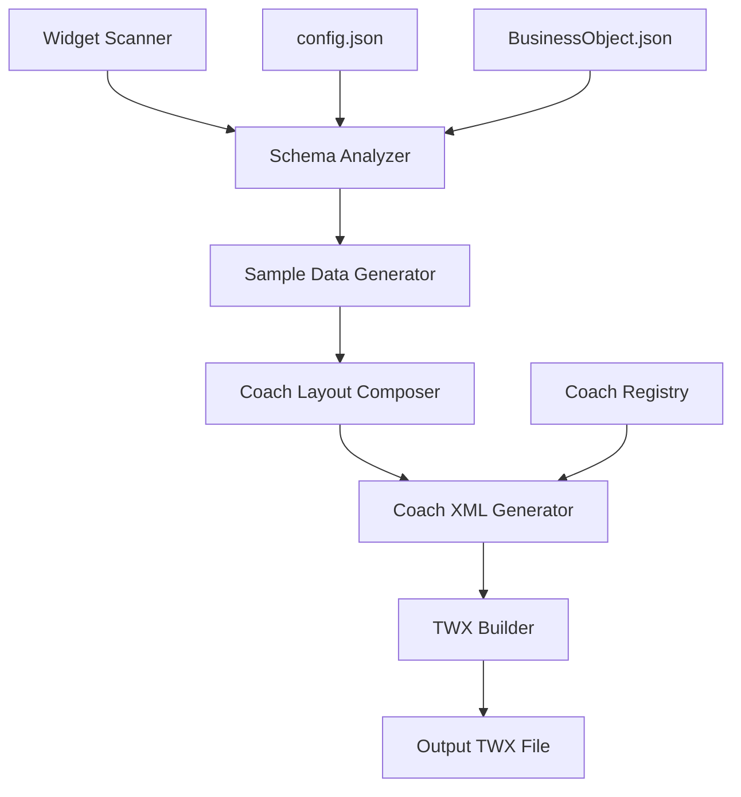

# BAW Coach Composer - Implementation Plan

## Overview

Create a system to automatically generate BAW Coach Views (test coaches) that include all custom widgets from the toolkit, with auto-generated sample data. These coaches will be packaged into the TWX file alongside the widgets for easy testing in BAW.

## Goals

1. **Auto-detect widgets** from the `widgets/` directory
2. **Generate sample data** from widget schemas (config.json and business object JSON files)
3. **Create BAW Coach XML** (65.*.xml format) with proper structure
4. **Arrange widgets** in a logical layout within the coach
5. **Package coaches** into the toolkit TWX file
6. **Provide CLI interface** for generating test coaches on demand

## Architecture



## Component Design

### 1. Schema Analyzer (`toolkit_packager/analyzers/schema_analyzer.py`)

**Purpose**: Parse widget schemas to understand data requirements

**Key Functions**:
- `analyze_widget_schema(widget: Widget) -> SchemaInfo`
- `extract_binding_type(config: dict) -> BindingTypeInfo`
- `extract_config_options(config: dict) -> List[ConfigOption]`
- `load_business_object_schema(bo_file: Path) -> dict`

**Output**: Structured information about widget data requirements

### 2. Sample Data Generator (`toolkit_packager/generators/sample_data_generator.py`)

**Purpose**: Generate realistic test data based on widget schemas

**Key Functions**:
- `generate_sample_data(widget: Widget) -> dict`
- `generate_from_business_object(bo_schema: dict) -> dict`
- `generate_list_data(item_schema: dict, count: int) -> List[dict]`
- `generate_primitive_value(type: str, constraints: dict) -> Any`

**Data Generation Rules**:
- **String**: Generate meaningful text based on property name
- **Integer**: Use reasonable defaults (0-100 range)
- **Boolean**: Default to true for visibility options
- **Date**: Use current date/time
- **Lists**: Generate 3-5 sample items
- **Objects**: Recursively generate nested structures

### 3. Coach Layout Composer (`toolkit_packager/composers/coach_layout_composer.py`)

**Purpose**: Arrange widgets in a logical coach layout

**Key Functions**:
- `compose_coach_layout(widgets: List[Widget]) -> CoachLayout`
- `create_widget_section(widget: Widget, data: dict) -> LayoutSection`
- `arrange_in_grid(sections: List[LayoutSection]) -> str`

**Layout Strategy**:
- Group widgets by category (navigation, data display, forms, etc.)
- Create sections with headers for each widget
- Use responsive grid layout (2 columns on desktop, 1 on mobile)
- Add spacing and visual separation between widgets

### 4. Coach XML Generator (`toolkit_packager/generators/coach_generator.py`)

**Purpose**: Generate BAW Coach XML (65.*.xml format)

**Key Functions**:
- `generate_coach_xml(coach_name: str, widgets: List[Widget], data: dict) -> str`
- `create_coach_header(coach_id: str, name: str) -> str`
- `create_data_bindings(widgets: List[Widget], data: dict) -> str`
- `create_layout_section(widget: Widget, binding: str) -> str`
- `create_coach_footer() -> str`

**XML Structure**:
```xml
<object type="Coach" id="65.xxx-xxx-xxx">
  <name>Widget Test Coach</name>
  <description>Auto-generated test coach for custom widgets</description>
  <data>
    <!-- Variable declarations for each widget -->
  </data>
  <layout>
    <!-- Widget placements and layout -->
  </layout>
  <scripts>
    <!-- Initialization and event handling scripts -->
  </scripts>
</object>
```

### 5. Coach Registry (`toolkit_packager/utils/coach_registry.py`)

**Purpose**: Maintain stable coach IDs across packaging operations

**Key Functions**:
- `get_coach_id(coach_name: str) -> Optional[str]`
- `register_coach(coach_name: str, coach_id: str)`
- `save_registry()`
- `load_registry()`

**Storage**: JSON file `toolkit_packager/baw_coaches.json`

```json
{
  "coaches": {
    "WidgetTestCoach": {
      "coach_id": "65.xxx-xxx-xxx",
      "created": "2026-05-03T14:00:00Z",
      "last_modified": "2026-05-03T14:00:00Z"
    }
  }
}
```

## Implementation Phases

### Phase 1: Core Infrastructure (Foundation)

**Tasks**:
1. Create `toolkit_packager/analyzers/` directory
2. Implement `schema_analyzer.py` with widget schema parsing
3. Create data models for schema information
4. Add unit tests for schema analysis

**Deliverables**:
- Schema analyzer that can parse config.json and business objects
- Data models: `SchemaInfo`, `BindingTypeInfo`, `ConfigOption`

### Phase 2: Data Generation (Sample Data)

**Tasks**:
1. Implement `sample_data_generator.py`
2. Create type-specific data generators
3. Handle nested objects and lists
4. Add validation for generated data

**Deliverables**:
- Sample data generator that creates realistic test data
- Support for all BAW data types (String, Integer, Boolean, Date, etc.)

### Phase 3: Coach Generation (XML Creation)

**Tasks**:
1. Create `toolkit_packager/composers/` directory
2. Implement `coach_layout_composer.py` for layout arrangement
3. Implement `coach_generator.py` for XML generation
4. Create coach registry system
5. Study BAW Coach XML format from sample TWX

**Deliverables**:
- Coach XML generator producing valid 65.*.xml files
- Layout composer with responsive grid system
- Coach registry for stable IDs

### Phase 4: Integration (Packaging)

**Tasks**:
1. Integrate coach generation into `package_multiple_widgets.py`
2. Add coach files to TWX builder
3. Update META-INF/package.xml to include coaches
4. Add configuration options for coach generation

**Deliverables**:
- Coaches automatically included in TWX packages
- Configuration in `toolkit.config.json` for coach options

### Phase 5: CLI & Documentation

**Tasks**:
1. Add CLI commands for coach generation
2. Create usage documentation
3. Add examples and tutorials
4. Create troubleshooting guide

**Deliverables**:
- CLI: `python3 generate_test_coach.py [options]`
- Comprehensive documentation
- Example coaches

## Configuration Schema

Add to `toolkit.config.json`:

```json
{
  "coaches": {
    "generate": true,
    "output_directory": "coaches",
    "test_coach": {
      "name": "Widget Test Coach",
      "description": "Auto-generated test coach for custom widgets",
      "include_all_widgets": true,
      "layout": "grid",
      "columns": 2
    }
  }
}
```

## File Structure

```
toolkit_packager/
├── analyzers/
│   ├── __init__.py
│   └── schema_analyzer.py
├── composers/
│   ├── __init__.py
│   └── coach_layout_composer.py
├── generators/
│   ├── coach_generator.py          # New
│   └── sample_data_generator.py    # New
├── utils/
│   └── coach_registry.py           # New
├── baw_coaches.json                # New registry file
└── ...

coaches/                             # New directory
├── WidgetTestCoach.xml             # Generated coach XML
└── README.md

generate_test_coach.py              # New CLI script
```

## Usage Examples

### Generate Test Coach

```bash
# Generate test coach for all widgets
python3 generate_test_coach.py

# Generate test coach for specific widgets
python3 generate_test_coach.py --widgets Breadcrumb,Stepper,ProgressBar

# Generate with custom name
python3 generate_test_coach.py --name "My Test Coach"

# Preview without saving
python3 generate_test_coach.py --preview
```

### Package with Coaches

```bash
# Package widgets and coaches together
python3 package_multiple_widgets.py --include-coaches

# Package without coaches
python3 package_multiple_widgets.py --no-coaches
```

### Programmatic Usage

```python
from toolkit_packager import scan_project
from toolkit_packager.generators import CoachGenerator, SampleDataGenerator
from toolkit_packager.composers import CoachLayoutComposer

# Scan widgets
widgets = scan_project(Path("."))

# Generate sample data
data_gen = SampleDataGenerator()
sample_data = {w.name: data_gen.generate_sample_data(w) for w in widgets}

# Compose layout
composer = CoachLayoutComposer()
layout = composer.compose_coach_layout(widgets)

# Generate coach XML
coach_gen = CoachGenerator()
coach_xml = coach_gen.generate_coach_xml(
    coach_name="Widget Test Coach",
    widgets=widgets,
    data=sample_data
)

# Save to file
Path("coaches/WidgetTestCoach.xml").write_text(coach_xml)
```

## Testing Strategy

### Unit Tests
- Schema analyzer with various widget configurations
- Sample data generator for all data types
- Coach XML generator output validation

### Integration Tests
- End-to-end coach generation from widgets
- TWX packaging with coaches included
- Import generated TWX into BAW (manual)

### Validation
- XML schema validation against BAW format
- Data binding validation
- Layout rendering validation

## Success Criteria

1. ✅ System auto-detects all widgets in `widgets/` directory
2. ✅ Generates valid sample data for each widget
3. ✅ Creates properly formatted BAW Coach XML (65.*.xml)
4. ✅ Coaches can be imported into BAW without errors
5. ✅ Widgets render correctly in generated coaches
6. ✅ Sample data displays properly in each widget
7. ✅ Coaches are included in TWX package automatically
8. ✅ CLI provides easy interface for coach generation
9. ✅ Documentation is clear and comprehensive
10. ✅ System is extensible for future enhancements

## Future Enhancements

- **Interactive Coach Builder**: GUI for designing coach layouts
- **Custom Data Templates**: User-defined sample data templates
- **Multiple Coach Variants**: Generate different coach layouts
- **Event Handler Testing**: Include event handler test scenarios
- **Performance Testing**: Generate coaches with large datasets
- **Localization Testing**: Generate coaches with multiple languages
- **Responsive Preview**: HTML preview of coach layout
- **Coach Validation**: Validate coach XML before packaging

## Dependencies

- Python 3.8+
- Standard library only (no external dependencies)
- Existing toolkit_packager modules
- BAW 25.0.1+ for import compatibility

## Timeline Estimate

- **Phase 1**: 2-3 days (Schema analysis)
- **Phase 2**: 2-3 days (Data generation)
- **Phase 3**: 3-4 days (Coach XML generation)
- **Phase 4**: 2-3 days (Integration)
- **Phase 5**: 2-3 days (CLI & docs)

**Total**: 11-16 days for complete implementation

## Risk Mitigation

1. **BAW XML Format Changes**: Study sample TWX thoroughly, maintain flexibility
2. **Complex Widget Schemas**: Start with simple widgets, add complexity gradually
3. **Data Generation Edge Cases**: Comprehensive testing with various schemas
4. **Integration Issues**: Modular design allows independent testing
5. **Performance**: Optimize for large numbers of widgets if needed

## Next Steps

1. Review and approve this plan
2. Extract and analyze sample TWX structure (testUI - 2.twx)
3. Begin Phase 1 implementation
4. Create initial prototypes for validation
5. Iterate based on feedback

---

**Document Version**: 1.0  
**Created**: 2026-05-03  
**Author**: Bob (Plan Mode)  
**Status**: Awaiting Approval