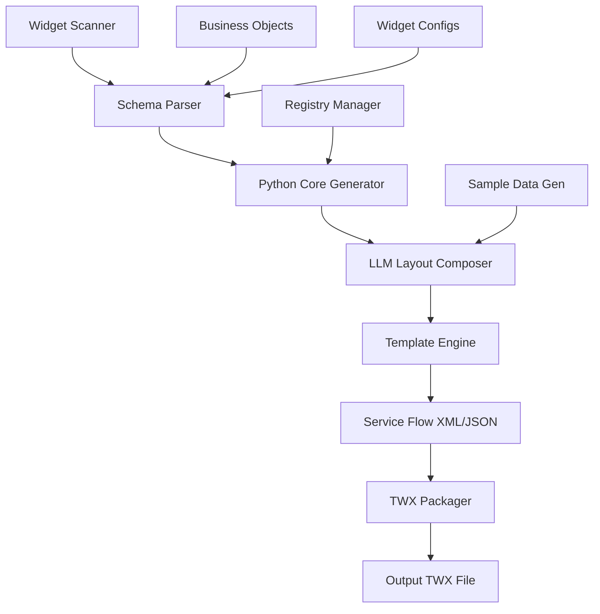

# BAW Coach Generator - Hybrid Implementation Plan

## Executive Summary

Build a hybrid Python + LLM system to automatically generate BAW Service Flows (test coaches) that compose widgets and business objects into functional UI screens. The system will leverage Python for structural generation and LLM for intelligent layout composition.

## Architecture Overview



## Phase 1: Foundation (Python Core) - Week 1

### 1.1 Template System

**Goal**: Create reusable XML/JSON templates for service flow components

**Files to Create**:
```
toolkit_packager/templates/
├── __init__.py
├── service_flow_template.py
├── bpmn_elements.py
└── widget_layout.py
```

**Implementation**:

```python
# service_flow_template.py
class ServiceFlowTemplate:
    """Base template for service flow XML structure"""
    
    @staticmethod
    def create_root(flow_id, name, description=""):
        """Generate root <process> element"""
        return f'''<?xml version="1.0" encoding="UTF-8"?>
<teamworks>
    <process id="{flow_id}" name="{name}">
        <processType>10</processType>
        <description>{description}</description>
        {{content}}
    </process>
</teamworks>'''
    
    @staticmethod
    def create_variable(var_id, name, class_id, is_array=False):
        """Generate processVariable element"""
        return f'''<processVariable name="{name}">
    <processVariableId>{var_id}</processVariableId>
    <namespace>2</namespace>
    <isArrayOf>{str(is_array).lower()}</isArrayOf>
    <classId>{class_id}</classId>
</processVariable>'''
```

**Deliverables**:
- [ ] Service flow root template
- [ ] Process variable templates
- [ ] BPMN element templates (start, end, formTask, scriptTask, sequenceFlow)
- [ ] Widget layout item templates
- [ ] Coach definition templates (JSON and XML)

### 1.2 Schema Parser

**Goal**: Extract widget and business object metadata

**Files to Create**:
```
toolkit_packager/parsers/
├── __init__.py
├── widget_schema_parser.py
└── business_object_parser.py
```

**Implementation**:

```python
# widget_schema_parser.py
from pathlib import Path
import json
from typing import Dict, List, Optional
from dataclasses import dataclass

@dataclass
class WidgetSchema:
    name: str
    coach_view_id: str
    binding_type: str
    is_list: bool
    config_options: List[Dict]
    business_objects: List[str]
    
class WidgetSchemaParser:
    """Parse widget config.json and extract metadata"""
    
    def parse(self, widget_path: Path) -> WidgetSchema:
        """Parse widget configuration"""
        config_file = widget_path / "widget" / "config.json"
        
        if not config_file.exists():
            raise FileNotFoundError(f"config.json not found: {config_file}")
        
        config = json.loads(config_file.read_text())
        
        return WidgetSchema(
            name=config.get("name"),
            coach_view_id=self._get_coach_view_id(widget_path),
            binding_type=config.get("bindingType", {}).get("type"),
            is_list=config.get("bindingType", {}).get("isList", False),
            config_options=config.get("configOptions", []),
            business_objects=self._extract_business_objects(config)
        )
    
    def _get_coach_view_id(self, widget_path: Path) -> str:
        """Get coach view ID from registry"""
        from ..utils.coach_view_registry import get_coach_view_registry
        registry = get_coach_view_registry()
        return registry.get_coach_view_id(widget_path.name)
    
    def _extract_business_objects(self, config: dict) -> List[str]:
        """Extract business object names"""
        return [bo.get("name") for bo in config.get("businessObjects", [])]
```

**Deliverables**:
- [ ] Widget schema parser
- [ ] Business object schema parser
- [ ] Configuration option extractor
- [ ] Data type mapper (BAW types to Python types)

### 1.3 Registry Manager

**Goal**: Manage stable IDs for service flows and components

**Files to Create**:
```
toolkit_packager/utils/
├── service_flow_registry.py
└── baw_service_flows.json (data file)
```

**Implementation**:

```python
# service_flow_registry.py
import json
from pathlib import Path
from typing import Optional, Dict
from datetime import datetime
from ..core import generate_object_id

class ServiceFlowRegistry:
    """Manage service flow IDs for consistent packaging"""
    
    def __init__(self, registry_file: Optional[Path] = None):
        if registry_file is None:
            registry_file = Path(__file__).parent / "baw_service_flows.json"
        
        self.registry_file = registry_file
        self.registry = self._load_registry()
    
    def _load_registry(self) -> Dict:
        """Load registry from file"""
        if self.registry_file.exists():
            return json.loads(self.registry_file.read_text())
        return {"service_flows": {}}
    
    def get_service_flow_id(self, flow_name: str) -> Optional[str]:
        """Get existing service flow ID"""
        return self.registry["service_flows"].get(flow_name, {}).get("flow_id")
    
    def register_service_flow(self, flow_name: str, flow_id: str):
        """Register new service flow"""
        self.registry["service_flows"][flow_name] = {
            "flow_id": flow_id,
            "created": datetime.utcnow().isoformat(),
            "last_modified": datetime.utcnow().isoformat()
        }
        self._save_registry()
    
    def _save_registry(self):
        """Save registry to file"""
        self.registry_file.write_text(json.dumps(self.registry, indent=2))

# Singleton instance
_registry = None

def get_service_flow_registry() -> ServiceFlowRegistry:
    """Get singleton registry instance"""
    global _registry
    if _registry is None:
        _registry = ServiceFlowRegistry()
    return _registry
```

**Deliverables**:
- [ ] Service flow registry
- [ ] ID generation utilities
- [ ] Registry persistence (JSON file)
- [ ] Registry query methods

## Phase 2: Python Core Generator - Week 2

### 2.1 Service Flow Generator

**Goal**: Generate complete service flow XML structure

**Files to Create**:
```
toolkit_packager/generators/
├── service_flow_generator.py
├── bpmn_generator.py
└── coach_definition_generator.py
```

**Implementation**:

```python
# service_flow_generator.py
from pathlib import Path
from typing import List, Dict
from ..models import Widget
from ..parsers import WidgetSchemaParser
from ..templates import ServiceFlowTemplate, BPMNElements
from ..utils import get_service_flow_registry
from ..core import generate_object_id

class ServiceFlowGenerator:
    """Generate BAW Service Flow XML with embedded coach"""
    
    def __init__(self, flow_name: str, widgets: List[Widget]):
        self.flow_name = flow_name
        self.widgets = widgets
        self.parser = WidgetSchemaParser()
        self.registry = get_service_flow_registry()
        
    def generate(self) -> str:
        """Generate complete service flow XML"""
        # 1. Get or generate flow ID
        flow_id = self._get_flow_id()
        
        # 2. Parse widget schemas
        schemas = [self.parser.parse(w.path) for w in self.widgets]
        
        # 3. Generate variables
        variables = self._generate_variables(schemas)
        
        # 4. Request layout from LLM (Phase 3)
        layout = self._compose_layout(schemas)
        
        # 5. Generate BPMN elements
        bpmn = self._generate_bpmn(layout)
        
        # 6. Build complete XML
        xml = self._build_xml(flow_id, variables, bpmn)
        
        return xml
    
    def _get_flow_id(self) -> str:
        """Get or generate service flow ID"""
        flow_id = self.registry.get_service_flow_id(self.flow_name)
        if not flow_id:
            flow_id = generate_object_id(self.flow_name, "1")
            self.registry.register_service_flow(self.flow_name, flow_id)
        return flow_id
    
    def _generate_variables(self, schemas: List) -> List[str]:
        """Generate process variables for widgets"""
        variables = []
        for schema in schemas:
            var_id = generate_object_id(f"{schema.name}_var", "2056")
            var_xml = ServiceFlowTemplate.create_variable(
                var_id=var_id,
                name=schema.name.lower(),
                class_id=self._get_class_id(schema),
                is_array=schema.is_list
            )
            variables.append(var_xml)
        return variables
    
    def _compose_layout(self, schemas: List) -> Dict:
        """Compose layout (placeholder for LLM integration)"""
        # Phase 3: LLM will decide layout
        return {
            "screens": [
                {
                    "name": "Screen 1",
                    "widgets": schemas
                }
            ]
        }
    
    def _generate_bpmn(self, layout: Dict) -> str:
        """Generate BPMN flow elements"""
        # Generate: Start -> Screen(s) -> End
        elements = []
        
        # Start event
        start_id = generate_object_id("start", "")
        elements.append(BPMNElements.create_start_event(start_id))
        
        # Form tasks for each screen
        prev_id = start_id
        for screen in layout["screens"]:
            screen_id = generate_object_id(screen["name"], "2025")
            elements.append(BPMNElements.create_form_task(
                screen_id, 
                screen["name"],
                screen["widgets"]
            ))
            # Sequence flow
            flow_id = generate_object_id(f"flow_{prev_id}_{screen_id}", "2027")
            elements.append(BPMNElements.create_sequence_flow(
                flow_id, prev_id, screen_id
            ))
            prev_id = screen_id
        
        # End event
        end_id = generate_object_id("end", "")
        elements.append(BPMNElements.create_end_event(end_id))
        
        # Final sequence flow
        flow_id = generate_object_id(f"flow_{prev_id}_{end_id}", "2027")
        elements.append(BPMNElements.create_sequence_flow(
            flow_id, prev_id, end_id
        ))
        
        return "\n".join(elements)
    
    def _build_xml(self, flow_id: str, variables: List[str], bpmn: str) -> str:
        """Build complete service flow XML"""
        content = f"""
        {chr(10).join(variables)}
        <coachflow>
            {bpmn}
        </coachflow>
        """
        return ServiceFlowTemplate.create_root(
            flow_id=flow_id,
            name=self.flow_name,
            description=f"Auto-generated test coach for {len(self.widgets)} widgets"
        ).replace("{content}", content)
    
    def _get_class_id(self, schema) -> str:
        """Get business object class ID"""
        # Format: {toolkit-id}/{bo-id}
        # This will be enhanced in Phase 2
        return f"toolkit-id/bo-id"
```

**Deliverables**:
- [ ] Service flow generator class
- [ ] BPMN element generator
- [ ] Coach definition generator (JSON and XML)
- [ ] Variable generator
- [ ] Sequence flow generator

### 2.2 BPMN Elements Generator

**Files**: `toolkit_packager/templates/bpmn_elements.py`

```python
class BPMNElements:
    """Generate BPMN flow elements"""
    
    @staticmethod
    def create_start_event(event_id: str) -> str:
        """Generate start event"""
        return f'''<ns16:startEvent name="Start" id="{event_id}">
    <ns16:extensionElements>
        <ns13:nodeVisualInfo x="50" y="200" width="24" height="24" color="#F8F8F8" />
    </ns16:extensionElements>
    <ns16:outgoing>{{outgoing}}</ns16:outgoing>
</ns16:startEvent>'''
    
    @staticmethod
    def create_form_task(task_id: str, name: str, widgets: List) -> str:
        """Generate form task with coach definition"""
        widget_items = [
            BPMNElements._create_widget_layout_item(w) 
            for w in widgets
        ]
        
        return f'''<ns3:formTask name="{name}" id="{task_id}">
    <ns16:extensionElements>
        <ns13:nodeVisualInfo x="200" y="178" width="95" height="70" />
    </ns16:extensionElements>
    <ns16:incoming>{{incoming}}</ns16:incoming>
    <ns16:outgoing>{{outgoing}}</ns16:outgoing>
    <ns3:formDefinition>
        <ns19:coachDefinition>
            <ns19:layout>
                {chr(10).join(widget_items)}
            </ns19:layout>
        </ns19:coachDefinition>
    </ns3:formDefinition>
</ns3:formTask>'''
    
    @staticmethod
    def _create_widget_layout_item(widget_schema) -> str:
        """Generate widget layout item"""
        item_id = generate_object_id(f"{widget_schema.name}_item", "")
        
        config_data = [
            f'''<ns19:configData>
    <ns19:id>{generate_object_id(f"config_{opt['name']}", "")}</ns19:id>
    <ns19:optionName>{opt['name']}</ns19:optionName>
    <ns19:value>{opt.get('default', '')}</ns19:value>
</ns19:configData>'''
            for opt in widget_schema.config_options
        ]
        
        return f'''<ns19:layoutItem xmlns:xsi="http://www.w3.org/2001/XMLSchema-instance" 
                       xsi:type="ns19:ViewRef" version="8550">
    <ns19:id>{item_id}</ns19:id>
    <ns19:layoutItemId>{widget_schema.name}1</ns19:layoutItemId>
    <ns19:viewUUID>{widget_schema.coach_view_id}</ns19:viewUUID>
    <ns19:binding>tw.local.{widget_schema.name.lower()}</ns19:binding>
    {chr(10).join(config_data)}
</ns19:layoutItem>'''
```

**Deliverables**:
- [ ] Start event generator
- [ ] End event generator
- [ ] Form task generator
- [ ] Script task generator
- [ ] Sequence flow generator
- [ ] Widget layout item generator

## Phase 3: LLM Integration - Week 3

### 3.1 LLM Layout Composer

**Goal**: Use LLM to intelligently compose widget layouts

**Files to Create**:
```
toolkit_packager/ai/
├── __init__.py
├── layout_composer.py
├── sample_data_generator.py
└── prompts.py
```

**Implementation**:

```python
# layout_composer.py
from typing import List, Dict
import json

class LLMLayoutComposer:
    """Use LLM to compose intelligent widget layouts"""
    
    def __init__(self, llm_client=None):
        self.llm_client = llm_client or self._get_default_client()
    
    def compose_screens(self, widget_schemas: List, context: Dict = None) -> Dict:
        """
        Ask LLM to compose widgets into logical screens
        
        Returns:
        {
            "screens": [
                {
                    "name": "Screen 1",
                    "description": "...",
                    "widgets": [widget_schema1, widget_schema2],
                    "layout_type": "vertical|horizontal|grid"
                }
            ],
            "flow": {
                "navigation": "linear|branching",
                "scripts": [...]
            }
        }
        """
        prompt = self._build_layout_prompt(widget_schemas, context)
        response = self._call_llm(prompt)
        return self._parse_layout_response(response)
    
    def _build_layout_prompt(self, schemas: List, context: Dict) -> str:
        """Build prompt for LLM"""
        widget_info = "\n".join([
            f"- {s.name}: {s.binding_type} ({'list' if s.is_list else 'single'})"
            for s in schemas
        ])
        
        return f"""You are a BAW UI designer. Compose these widgets into logical screens:

Widgets:
{widget_info}

Requirements:
1. Group related widgets together
2. Create 1-3 screens maximum
3. Ensure logical flow between screens
4. Consider data dependencies
5. Provide clear screen names and descriptions

Return JSON format:
{{
    "screens": [
        {{
            "name": "Screen Name",
            "description": "Purpose of this screen",
            "widgets": ["WidgetName1", "WidgetName2"],
            "layout_type": "vertical"
        }}
    ]
}}"""
    
    def _call_llm(self, prompt: str) -> str:
        """Call LLM API"""
        # Implementation depends on LLM provider
        # Could use OpenAI, Anthropic, or local model
        pass
    
    def _parse_layout_response(self, response: str) -> Dict:
        """Parse LLM response"""
        try:
            return json.loads(response)
        except json.JSONDecodeError:
            # Fallback to simple layout
            return self._create_default_layout()
```

**Deliverables**:
- [ ] LLM layout composer
- [ ] Prompt templates
- [ ] Response parser
- [ ] Fallback logic for LLM failures

### 3.2 Sample Data Generator

**Goal**: Generate realistic test data using LLM

```python
# sample_data_generator.py
class SampleDataGenerator:
    """Generate sample data for widgets using LLM"""
    
    def generate_for_widget(self, widget_schema, context: Dict = None) -> str:
        """
        Generate JavaScript initialization code for widget data
        
        Returns JavaScript code like:
        var autoObject = {};
        autoObject.value = 100;
        autoObject.percentage = 30;
        autoObject
        """
        prompt = self._build_data_prompt(widget_schema, context)
        response = self._call_llm(prompt)
        return self._format_as_javascript(response)
    
    def _build_data_prompt(self, schema, context) -> str:
        """Build prompt for data generation"""
        return f"""Generate realistic sample data for a {schema.name} widget.

Widget Type: {schema.binding_type}
Is List: {schema.is_list}
Business Objects: {schema.business_objects}

Generate appropriate test data that demonstrates the widget's functionality.
Return as JSON object."""
    
    def _format_as_javascript(self, data: str) -> str:
        """Convert JSON to JavaScript initialization code"""
        # Parse JSON and convert to JS variable assignment
        pass
```

**Deliverables**:
- [ ] Sample data generator
- [ ] Type-specific data generators
- [ ] JavaScript code formatter
- [ ] Validation logic

## Phase 4: Integration & CLI - Week 4

### 4.1 CLI Interface

**Files to Create**:
```
generate_coach.py (root level)
```

**Implementation**:

```python
#!/usr/bin/env python3
"""
Generate BAW test coach from widgets
"""
import argparse
from pathlib import Path
from toolkit_packager import scan_project
from toolkit_packager.generators import ServiceFlowGenerator
from toolkit_packager.ai import LLMLayoutComposer

def main():
    parser = argparse.ArgumentParser(
        description="Generate BAW test coach from widgets"
    )
    parser.add_argument(
        "--name",
        default="Widget Test Coach",
        help="Name of the coach"
    )
    parser.add_argument(
        "--widgets",
        help="Comma-separated list of widget names (default: all)"
    )
    parser.add_argument(
        "--output",
        default="coaches",
        help="Output directory"
    )
    parser.add_argument(
        "--no-llm",
        action="store_true",
        help="Disable LLM layout composition"
    )
    
    args = parser.parse_args()
    
    # Scan widgets
    print("Scanning widgets...")
    widgets = scan_project(Path("."))
    
    if args.widgets:
        widget_names = [w.strip() for w in args.widgets.split(",")]
        widgets = [w for w in widgets if w.name in widget_names]
    
    print(f"Found {len(widgets)} widget(s)")
    
    # Generate coach
    print(f"Generating coach: {args.name}")
    generator = ServiceFlowGenerator(args.name, widgets)
    
    if not args.no_llm:
        generator.set_layout_composer(LLMLayoutComposer())
    
    xml = generator.generate()
    
    # Save output
    output_dir = Path(args.output)
    output_dir.mkdir(exist_ok=True)
    
    output_file = output_dir / f"{args.name.replace(' ', '_')}.xml"
    output_file.write_text(xml)
    
    print(f"✓ Coach generated: {output_file}")
    print(f"\nNext steps:")
    print(f"1. Package into TWX: python3 package_multiple_widgets.py --include-coaches")
    print(f"2. Import TWX into BAW")
    print(f"3. Test the coach")

if __name__ == "__main__":
    main()
```

**Deliverables**:
- [ ] CLI script
- [ ] Command-line argument parsing
- [ ] Widget filtering
- [ ] Output management

### 4.2 TWX Integration

**Goal**: Integrate coach generation into packaging workflow

**Files to Modify**:
```
package_multiple_widgets.py
toolkit_packager/packager/twx_builder.py
```

**Implementation**:

```python
# In package_multiple_widgets.py
def main():
    parser = argparse.ArgumentParser()
    # ... existing args ...
    parser.add_argument(
        "--include-coaches",
        action="store_true",
        help="Generate and include test coaches"
    )
    parser.add_argument(
        "--coach-name",
        default="Widget Test Coach",
        help="Name for generated coach"
    )
    
    args = parser.parse_args()
    
    # ... existing code ...
    
    if args.include_coaches:
        print("\nGenerating test coach...")
        from toolkit_packager.generators import ServiceFlowGenerator
        
        generator = ServiceFlowGenerator(args.coach_name, widgets)
        coach_xml = generator.generate()
        
        # Add to TWX builder
        builder.add_service_flow(coach_xml)
    
    # ... rest of packaging ...
```

**Deliverables**:
- [ ] TWX builder integration
- [ ] Service flow packaging
- [ ] META-INF/package.xml updates
- [ ] Dependency management

## Phase 5: Testing & Documentation - Week 5

### 5.1 Testing

**Test Cases**:
1. **Single Widget Coach**
   - Generate coach with 1 widget
   - Verify XML structure
   - Import into BAW
   - Test functionality

2. **Multiple Widgets Coach**
   - Generate coach with 5+ widgets
   - Verify layout composition
   - Test data bindings
   - Verify navigation

3. **Complex Business Objects**
   - Test with nested objects
   - Test with lists
   - Verify data initialization

4. **LLM Integration**
   - Test layout composition
   - Test sample data generation
   - Test fallback logic

**Deliverables**:
- [ ] Unit tests for each component
- [ ] Integration tests
- [ ] BAW import tests
- [ ] Performance tests

### 5.2 Documentation

**Files to Create**:
```
docs/
├── COACH_GENERATOR_GUIDE.md
├── API_REFERENCE.md
├── EXAMPLES.md
└── TROUBLESHOOTING.md
```

**Content**:
- [ ] User guide
- [ ] API documentation
- [ ] Usage examples
- [ ] Troubleshooting guide
- [ ] Architecture documentation

## Timeline Summary

| Week | Phase | Deliverables |
|------|-------|--------------|
| 1 | Foundation | Templates, Parsers, Registry |
| 2 | Core Generator | Service Flow, BPMN, Variables |
| 3 | LLM Integration | Layout Composer, Data Generator |
| 4 | Integration | CLI, TWX Packaging |
| 5 | Testing & Docs | Tests, Documentation |

## Success Criteria

- [ ] Generate valid service flow XML
- [ ] Successfully import into BAW
- [ ] Widgets render correctly
- [ ] Data bindings work
- [ ] Navigation functions properly
- [ ] LLM provides intelligent layouts
- [ ] Sample data is realistic
- [ ] CLI is user-friendly
- [ ] Documentation is comprehensive
- [ ] Tests pass consistently

## Risk Mitigation

1. **XML Structure Complexity**
   - Mitigation: Use templates and incremental testing
   - Fallback: Start with simple structures

2. **LLM Reliability**
   - Mitigation: Implement fallback logic
   - Fallback: Use rule-based layout

3. **BAW Compatibility**
   - Mitigation: Test with multiple BAW versions
   - Fallback: Document version requirements

4. **Performance**
   - Mitigation: Optimize for large widget sets
   - Fallback: Batch processing

## Next Steps

1. **Review and approve this plan**
2. **Set up development environment**
3. **Begin Phase 1 implementation**
4. **Schedule weekly progress reviews**
5. **Prepare test BAW environment**

---

**Plan Version**: 1.0  
**Created**: 2026-05-03  
**Status**: Ready for Implementation