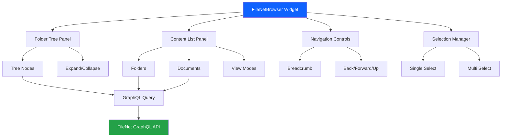
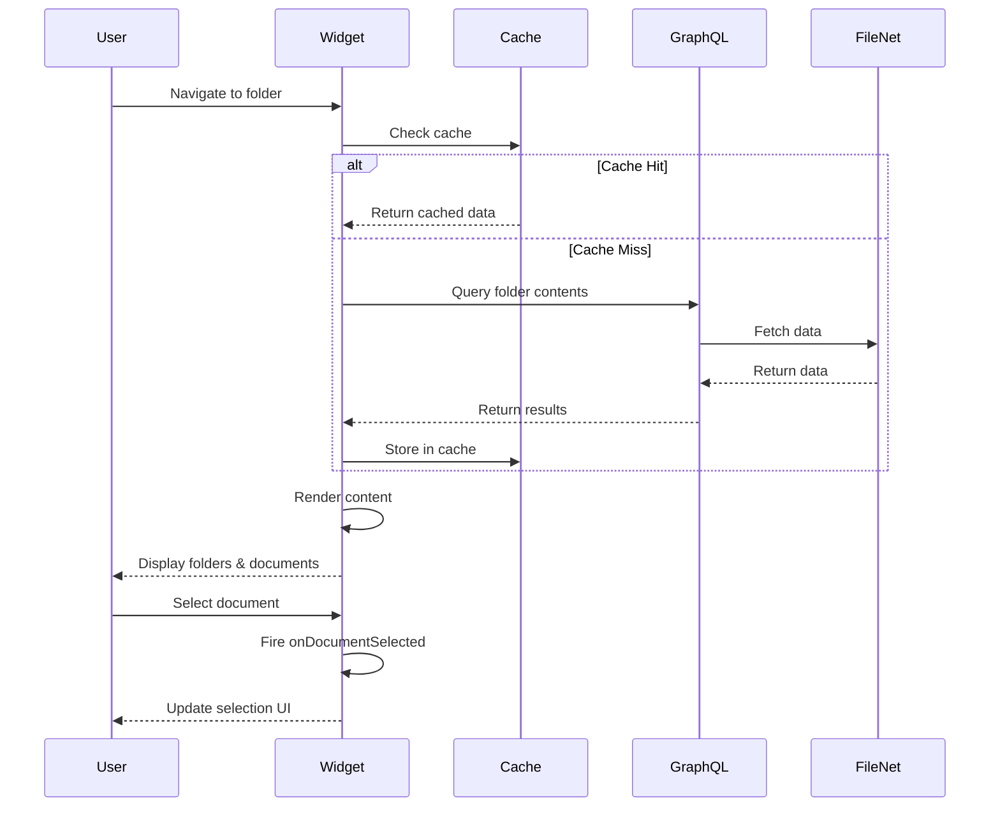

# FileNetBrowser Widget

A comprehensive folder and document browser widget for IBM FileNet Content Engine, designed for IBM Business Automation Workflow (BAW) coach views. Browse FileNet repositories with an intuitive dual-pane interface featuring a folder tree and content list.


## Features

- 📁 **Dual-Pane Interface**: Folder tree navigation on the left, content list on the right
- 🔍 **Hierarchical Browsing**: Navigate through folder structures with expandable tree view
- 📄 **Document Details**: View document versions, file sizes, and metadata
- 🎨 **Multiple View Modes**: Switch between list and grid views
- 🧭 **Navigation Controls**: Back/Forward/Up buttons and breadcrumb navigation
- ✅ **Selection Support**: Single or multi-select items with visual feedback
- 🔄 **Smart Caching**: Improved performance with folder content caching
- 🖱️ **Drag and Drop**: Move documents between folders with intuitive drag-and-drop
- 📄 **Pagination**: Configurable page size for large document lists
- ♿ **Accessible**: Full ARIA support and keyboard navigation
- 🎯 **Event-Driven**: Fire events on folder/document selection and navigation

## Quick Start

### 1. Installation

Copy the `FileNetBrowser` folder to your BAW project's custom widgets directory.

### 2. Add to Coach View

1. Open your coach view in BAW Designer
2. Drag the **FileNetBrowser** widget onto your canvas
3. Configure the required options (see Configuration section)

### 3. Basic Configuration

```javascript
// Required Options
graphqlEndpoint:      "https://your-filenet-host/content-services-graphql/graphql"
repositoryIdentifier: "OS1"
rootFolderPath:       "/Folder for Browsing"

// Optional Options
showDocumentDetails:  true
allowMultiSelect:     false
showBreadcrumb:       true
pageSize:             50
showPagination:       true
```

## Configuration Options

| Option | Type | Required | Default | Description |
|--------|------|----------|---------|-------------|
| `graphqlEndpoint` | String | **Yes** | `""` | Full URL of the FileNet GraphQL API endpoint |
| `repositoryIdentifier` | String | **Yes** | `""` | FileNet repository identifier (e.g., "OS1") |
| `rootFolderPath` | String | No | `"/"` | Starting folder path for browsing |
| `showDocumentDetails` | Boolean | No | `true` | Show document version and size information |
| `allowMultiSelect` | Boolean | No | `false` | Enable multi-selection with Ctrl/Cmd+Click |
| `showBreadcrumb` | Boolean | No | `true` | Display breadcrumb navigation |
| `pageSize` | Integer | No | `50` | Number of documents per page (0 = no pagination) |
| `showPagination` | Boolean | No | `true` | Show pagination controls |

## Events

### onFolderSelected

Fired when a user selects a folder (single-click).

**Event Data:**
```javascript
{
  type:     "folder",
  id:       "{A1B2C3D4-E5F6-7890-ABCD-EF1234567890}",
  name:     "Documents",
  pathName: "/Folder for Browsing/Documents"
}
```

**Example Handler:**
```javascript
tw.local.selectedFolder = this.getData();
tw.local.canOpenFolder = true;
```

### onDocumentSelected

Fired when a user selects or double-clicks a document.

**Event Data:**
```javascript
{
  type:    "document",
  id:      "{D0D98E6A-0000-CD12-BB33-2DC8E5CABEE1}",
  name:    "report.pdf",
  version: "v1.0"
}
```

**Example Handler:**
```javascript
tw.local.selectedDocument = this.getData();
tw.local.documentId = this.getData().id;
tw.local.showDocumentViewer = true;
```

### onNavigate

Fired when the user navigates to a different folder.

**Event Data:**
```javascript
{
  pathName: "/Folder for Browsing/Documents"
}
```

**Example Handler:**
```javascript
tw.local.currentPath = this.getData().pathName;
console.log("Navigated to: " + this.getData().pathName);
```

## GraphQL Queries

The widget uses the following GraphQL queries to interact with FileNet:

### Query Folder Contents

```graphql
query GetFolderContents($repoId: String!, $path: String!) {
  folder(repositoryIdentifier: $repoId, identifier: $path) {
    id
    name
    pathName
    subFolders {
      folders {
        id
        name
        pathName
      }
    }
    containedDocuments {
      documents {
        id
        name
        majorVersionNumber
        minorVersionNumber
        mimeType
        contentSize
      }
      pageInfo {
        totalCount
      }
    }
  }
}
```

**Variables:**
```json
{
  "repoId": "OS1",
  "path": "/Folder for Browsing"
}
```

## Usage Examples

### Example 1: Basic Document Browser

```javascript
// Coach View Configuration
FileNetBrowser Options:
  graphqlEndpoint:      "https://filenet.example.com/graphql"
  repositoryIdentifier: "OS1"
  rootFolderPath:       "/Documents"

// onDocumentSelected Event Handler
tw.local.selectedDocId = this.getData().id;
tw.local.selectedDocName = this.getData().name;
tw.local.showViewer = true;
```

### Example 2: Folder Selection for Upload

```javascript
// Coach View Configuration
FileNetBrowser Options:
  graphqlEndpoint:      "https://filenet.example.com/graphql"
  repositoryIdentifier: "OS1"
  rootFolderPath:       "/Uploads"
  showDocumentDetails:  false

// onFolderSelected Event Handler
tw.local.uploadTargetFolder = this.getData().pathName;
tw.local.uploadTargetId = this.getData().id;
tw.local.enableUploadButton = true;
```

### Example 3: Multi-Select Document Operations

```javascript
// Coach View Configuration
FileNetBrowser Options:
  graphqlEndpoint:      "https://filenet.example.com/graphql"
  repositoryIdentifier: "OS1"
  rootFolderPath:       "/Archive"
  allowMultiSelect:     true

// onDocumentSelected Event Handler
if (!tw.local.selectedDocuments) {
  tw.local.selectedDocuments = [];
}

tw.local.selectedDocuments.push({
  id:      this.getData().id,
  name:    this.getData().name,
  version: this.getData().version
});

tw.local.selectionCount = tw.local.selectedDocuments.length;
tw.local.canBulkDownload = tw.local.selectionCount > 0;
```

### Example 4: Navigation Tracking

```javascript
// onNavigate Event Handler
if (!tw.local.navigationHistory) {
  tw.local.navigationHistory = [];
}

tw.local.navigationHistory.push({
  path:      this.getData().pathName,
  timestamp: new Date().toISOString()
});

tw.local.currentLocation = this.getData().pathName;

// Clear selections on navigation
tw.local.selectedFolder = null;
tw.local.selectedDocument = null;
```

## Drag and Drop

The widget supports intuitive drag-and-drop operations for moving documents between folders.

### How to Use

1. **Drag a Document**: Click and hold on any document in the content list
2. **Drop on Target**: Drag over a folder (in content list or tree) and release
3. **Automatic Move**: The document is automatically moved to the target folder

### Visual Feedback

- **Dragging**: Document becomes semi-transparent with a move cursor
- **Valid Drop Target**: Folders highlight with a blue border when you drag over them
- **Processing**: Loading indicator appears during the move operation

### Technical Details

The move operation uses two FileNet GraphQL mutations:

1. **Unfile**: Removes the document from the source folder
   ```graphql
   deleteReferentialContainmentRelationship(
     repositoryIdentifier: "OS1"
     identifier: "/SourceFolder/{DocumentId}"
   )
   ```

2. **File**: Adds the document to the target folder
   ```graphql
   fileDocument(
     repositoryIdentifier: "OS1"
     identifier: "{DocumentId}"
     folderIdentifier: "/TargetFolder"
   )
   ```

### Limitations

- Only documents can be dragged (folders cannot be moved)
- Documents can only be dropped on folders
- The widget automatically refreshes affected folders after a successful move
- If the move fails, an error message is displayed and no changes are made


## Widget Architecture



## Data Flow



## Component Structure

```
FileNetBrowser/
├── widget/
│   ├── FileNetBrowser.json      # OpenAPI specification
│   ├── Layout.html              # Widget HTML structure
│   ├── InlineCSS.css            # Widget styling
│   ├── inlineJavascript.js      # Widget logic & GraphQL
│   ├── Datamodel.md             # Data model documentation
│   └── eventHandler.md          # Event handler documentation
├── AdvancePreview/
│   ├── FileNetBrowser.html      # Preview page
│   └── FileNetBrowser.js        # Preview mock data
└── README.md                    # This file
```

## Browser Compatibility

- ✅ Chrome 90+
- ✅ Firefox 88+
- ✅ Safari 14+
- ✅ Edge 90+

## Accessibility Features

- **ARIA Roles**: Proper semantic roles for tree, list, navigation
- **Keyboard Navigation**: Full keyboard support (Tab, Enter, Arrow keys)
- **Screen Reader Support**: Descriptive labels and live regions
- **Focus Management**: Clear focus indicators
- **Color Contrast**: WCAG AA compliant

## Performance Considerations

### Caching Strategy

The widget implements intelligent caching:
- Folder contents are cached after first load
- Cache persists during widget session
- Use **Refresh** button to clear cache and reload

### Best Practices

1. **Limit Root Folder Depth**: Start from a specific folder rather than root
2. **Use Pagination**: For folders with many items, consider server-side pagination
3. **Optimize Queries**: Only request needed fields in GraphQL queries
4. **Lazy Loading**: Tree nodes load children on demand

## Troubleshooting

### Widget shows "GraphQL endpoint is not configured"

**Solution**: Ensure `graphqlEndpoint` option is set with a valid URL.

### Widget shows "Repository identifier is not configured"

**Solution**: Set the `repositoryIdentifier` option (e.g., "OS1").

### Folder not found error

**Solution**: Verify the `rootFolderPath` exists in FileNet and user has access.

### Authentication errors

**Solution**: Ensure user is authenticated to FileNet. The widget uses browser cookies for authentication.

### Slow performance

**Solution**: 
- Use more specific `rootFolderPath` to limit scope
- Clear cache and refresh if data seems stale
- Check network latency to FileNet server

## Security

### Authentication

The widget uses `credentials: "include"` on all fetch requests, automatically forwarding browser session cookies. Users must be authenticated to FileNet before using the widget.

### Authorization

Access control is enforced by FileNet. Users can only browse folders and documents they have permission to access.

### Best Practices

1. Always use HTTPS for `graphqlEndpoint`
2. Implement proper session management in BAW
3. Set appropriate `rootFolderPath` to limit access scope
4. Audit folder access using `onNavigate` events

## Advanced Customization

### Custom Styling

Override CSS variables in your coach view:

```css
.fnbrowser-widget {
  --fnbrowser-blue: #0f62fe;
  --fnbrowser-blue-hover: #0043ce;
  --fnbrowser-border-r: 4px;
}
```

### Extending Functionality

The widget can be extended by:
1. Modifying GraphQL queries to fetch additional fields
2. Adding custom event handlers
3. Implementing additional view modes
4. Adding filtering and search capabilities

## Related Widgets

- **FileNetImport**: Upload files and folders to FileNet
- **Breadcrumb**: Standalone breadcrumb navigation
- **DateOutput**: Format and display dates

## Support

For issues, questions, or contributions:
- Review the [Datamodel.md](widget/Datamodel.md) for data structures
- Check [eventHandler.md](widget/eventHandler.md) for event details
- Examine the preview mode for testing: `AdvancePreview/FileNetBrowser.html`

## License

Apache 2.0

## Version History

### 1.0.0 (2026-03-03)
- Initial release
- Dual-pane folder browser
- GraphQL integration
- List and grid view modes
- Navigation controls
- Selection support
- Event handlers
- Accessibility features

---

**Made with Bob** 🤖