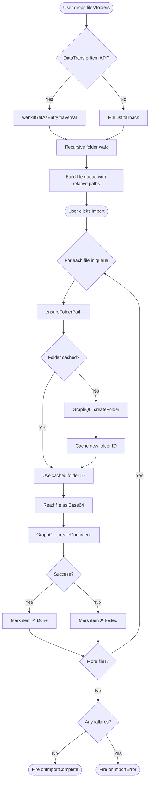
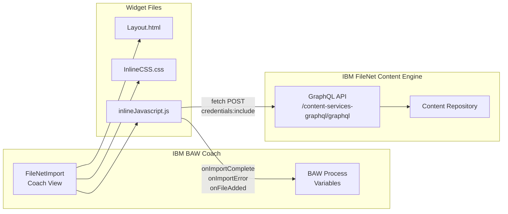
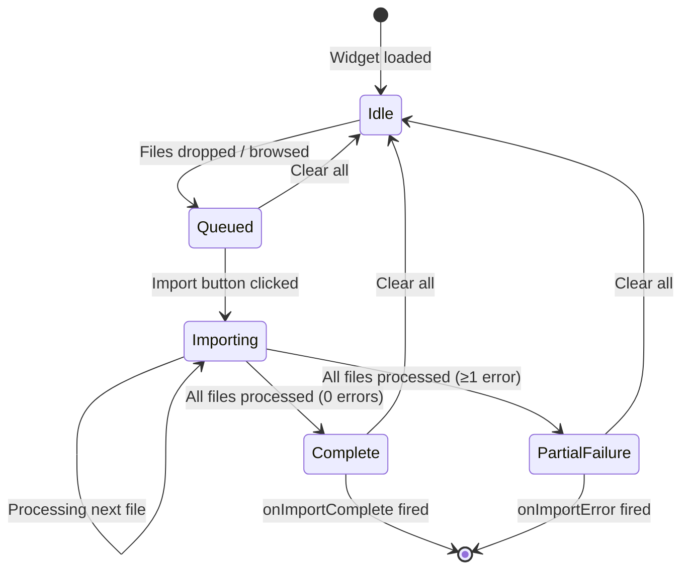

# FileNetImport Widget

A drag-and-drop document and folder import widget for IBM Business Automation Workflow (BAW) coach views. Imports files and entire folder trees into IBM FileNet Content Engine via the GraphQL API, preserving the original folder hierarchy.

---

## Features

- **Drag-and-drop** files and folders directly onto the widget
- **Folder structure preservation** — subfolders are recursively traversed and recreated in FileNet
- **Browse dialog** fallback for selecting files manually
- **Real-time progress** with per-file status badges and a progress bar
- **Import log** showing success, failure, and folder creation events
- **GraphQL API** integration with FileNet Content Engine (no extra auth needed — uses browser session)
- **ARIA accessibility** — full keyboard navigation and screen reader support
- **Configurable** endpoint, parent folder, file size limit, and MIME type filter

---

## Widget Structure

```
FileNetImport/
├── widget/
│   ├── Layout.html              # Coach view HTML template
│   ├── InlineCSS.css            # Widget styles (IBM Carbon-inspired)
│   ├── inlineJavascript.js      # Widget logic: DnD, GraphQL, event handling
│   ├── eventHandler.md          # Event handler documentation
│   ├── Datamodel.md             # Data model and GraphQL mutation reference
│   └── FileNetImport.json       # OpenAPI 3.0 schema specification
└── AdvancePreview/
    ├── FileNetImport.html        # BAW designer preview HTML
    └── FileNetImport.js          # BAW designer preview JavaScript (dojo)
```

---

## Configuration Options

Set these in the BAW Coach View designer **Properties** panel:

| Option                  | Type    | Required | Default | Description |
|-------------------------|---------|----------|---------|-------------|
| `graphqlEndpoint`       | String  | **Yes**  | `""`    | Full URL of the FileNet GraphQL API. Example: `https://filenet-host/content-services-graphql/graphql` |
| `repositoryIdentifier`  | String  | **Yes**  | `""`    | FileNet repository identifier (e.g., `"OS1"`). Identifies which object store to use. |
| `parentFolderPath`      | String  | **Yes**  | `"/"`   | FileNet folder path for imports. Example: `"/Folder for Browsing"` or `"/Projects/2024"`. |
| `maxFileSizeMB`         | Number  | No       | `100`   | Maximum file size in MB. Files exceeding this are skipped with a warning. |
| `allowedMimeTypes`      | String  | No       | `""`    | Comma-separated MIME types to accept. Empty = all types accepted. |
| `showImportLog`         | Boolean | No       | `true`  | Show or hide the import result log panel. Set to `false` to hide detailed import logs. |

### Example option binding in BAW

```javascript
// In the coach view configuration:
graphqlEndpoint       = "https://filenet-host/content-services-graphql/graphql"
repositoryIdentifier  = "OS1"
parentFolderPath      = "/Folder for Browsing"
maxFileSizeMB         = 50
allowedMimeTypes      = "application/pdf,image/png,application/msword"
showImportLog         = true  // Set to false to hide the log panel
```

---

## Events

### `onImportComplete`

Fired when **all** files are imported successfully (zero failures).

```javascript
// Event data:
{
  total:                 5,
  succeeded:             5,
  failed:                0,
  repositoryIdentifier:  "OS1",
  parentFolderPath:      "/Folder for Browsing"
}

// Example handler:
tw.local.importStatus = "success";
tw.local.importedCount = this.getData().succeeded;
```

### `onImportError`

Fired when the import finishes with **one or more failures**.

```javascript
// Event data:
{
  total:                 5,
  succeeded:             4,
  failed:                1,
  repositoryIdentifier:  "OS1",
  parentFolderPath:      "/Folder for Browsing"
}

// Example handler:
tw.local.importStatus = "partial";
tw.local.failedCount = this.getData().failed;
```

### `onFileAdded`

Fired each time a file is added to the queue.

```javascript
// Event data:
{
  path: "ProjectA/docs/spec.pdf",
  size: 204800
}

// Example handler:
console.log("Queued:", this.getData().path);
```

---

## GraphQL Mutations

### Create Folder

```graphql
mutation CreateFolder($repoId: String!, $name: String!, $parentPath: String!) {
  createFolder(
    repositoryIdentifier: $repoId
    folderProperties: {
      name: $name
      parent: {
        identifier: $parentPath
      }
    }
  ) {
    id
    name
    pathName
  }
}
```

**Variables:**
```json
{
  "repoId": "OS1",
  "name": "SubFolder",
  "parentPath": "/Folder for Browsing"
}
```

> **Note:** The `parent.identifier` specifies the path of the parent folder where the new folder will be created.

**Response:**
```json
{
  "data": {
    "createFolder": {
      "id": "{NEW-FOLDER-GUID}",
      "name": "SubFolder",
      "pathName": "/Folder for Browsing/SubFolder"
    }
  }
}
```

---

### Import Document (Multipart Form POST)

FileNet GraphQL requires documents to be uploaded using **multipart form POST** with the file as a separate part.

```graphql
mutation ($contvar: String) {
  createDocument(
    repositoryIdentifier: "OS1"
    fileInFolderIdentifier: "/Folder for Browsing"
    documentProperties: {
      name: "report.pdf"
      contentElements: {
        replace: [{
          type: CONTENT_TRANSFER
          contentType: "application/pdf"
          subContentTransfer: {
            content: $contvar
          }
        }]
      }
    }
    checkinAction: {}
  ) {
    id
    name
  }
}
```

**Multipart Form Structure:**

The request must be sent as `multipart/form-data` with two parts:

1. **`graphql` part** (JSON string):
```json
{
  "query": "<mutation string>",
  "variables": { "contvar": null }
}
```

2. **`contvar` part**: The actual file binary content

**JavaScript Implementation:**
```javascript
var formData = new FormData();
formData.append("graphql", JSON.stringify({
  query: mutation,
  variables: { contvar: null }
}));
formData.append("contvar", file);  // file is a File object

fetch(graphqlEndpoint, {
  method: "POST",
  credentials: "include",
  body: formData
});
```

> **Note:** The variable name `$contvar` in the mutation maps to the `contvar` part name in the multipart form. The browser automatically sets the correct `Content-Type: multipart/form-data` header with boundary.

> **Authentication:** All GraphQL calls use `credentials: "include"`, forwarding the browser's existing FileNet session cookies automatically. No additional auth configuration is needed.

---

## Folder Structure Preservation

When a folder is dropped, the widget uses the `FileSystemDirectoryEntry` API (`webkitGetAsEntry()`) to recursively traverse the entire tree. Each file's relative path is preserved and used to recreate the folder hierarchy under `parentFolderPath`.

**Example:** Dropping `ProjectA/` containing:
```
ProjectA/
  README.md
  docs/
    spec.pdf
    diagrams/
      arch.png
```

With `parentFolderPath = "/Folder for Browsing"`, results in FileNet:
```
/Folder for Browsing/
  ProjectA/
    README.md
    docs/
      spec.pdf
      diagrams/
        arch.png
```

Folders are created lazily (only when a file needs them) using the `createFolder` mutation with `fileInFolderIdentifier` pointing to the parent path. Created folder paths are cached within the session to avoid duplicate API calls.

---

## Architecture

### Import Flow



### Component Diagram



### State Machine



---

## DOM Access Pattern

```javascript
// Root container
var root = this.context.element.querySelector(".fnimport-widget");

// Drop zone
var dropzone = root.querySelector(".fnimport-dropzone");

// File queue list
var queueEl = root.querySelector(".fnimport-queue");

// Import button
var importBtn = root.querySelector(".fnimport-btn-import");

// Log panel
var logEl = root.querySelector(".fnimport-log");
```

---

## Accessibility

| Feature | Implementation |
|---------|---------------|
| Drop zone keyboard access | `tabindex="0"`, `Enter`/`Space` opens file dialog |
| ARIA roles | `role="region"`, `role="list"`, `role="listitem"`, `role="log"`, `role="progressbar"` |
| Live regions | `aria-live="polite"` on status bar and log |
| Progress bar | `aria-valuemin`, `aria-valuemax`, `aria-valuenow` updated dynamically |
| Remove buttons | `aria-label` includes file name |
| Focus indicators | 2px solid `#0f62fe` outline on all interactive elements |

---

## Browser Compatibility

| Feature | Chrome | Firefox | Edge | Safari |
|---------|--------|---------|------|--------|
| `DataTransferItem.webkitGetAsEntry()` | ✓ | ✓ | ✓ | ✓ |
| `FileSystemDirectoryEntry.createReader()` | ✓ | ✓ | ✓ | ✓ |
| `FileReader.readAsDataURL()` | ✓ | ✓ | ✓ | ✓ |
| `fetch()` with `credentials: "include"` | ✓ | ✓ | ✓ | ✓ |
| CSS Custom Properties | ✓ | ✓ | ✓ | ✓ |

> **Note:** The `webkitGetAsEntry()` API is required for folder drag-and-drop with structure preservation. All modern browsers support it. If unavailable, the widget falls back to flat file import.

---

## Limitations

- Files are read entirely into memory as Base64 before upload. For very large files (>50 MB), consider reducing `maxFileSizeMB`.
- Import is sequential (one file at a time) to avoid overwhelming the FileNet server. Parallel import is not implemented.
- Folder creation uses the `createFolder` mutation. If a folder with the same name already exists under the parent, the behaviour depends on the FileNet server configuration (may create a duplicate or return an error).
- The widget does not support updating existing documents — only creation of new ones.

---

## Made with Bob