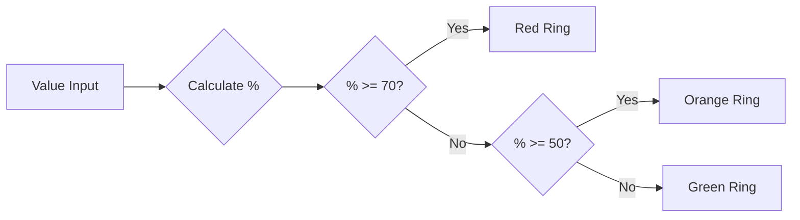

# ProcessCircle Widget

An IBM Business Automation Workflow (BAW) custom view widget that displays an integer value as an animated circular progress indicator with dynamic color-coded visual feedback.

## Overview

The ProcessCircle widget provides a visually appealing way to represent numeric progress or status values in IBM BAW applications. It features:

- **Animated circular progress bar** with smooth 3-second animation
- **Dynamic color-coding** based on percentage thresholds
- **Configurable value ranges** (min/max)
- **Customizable display suffix** (%, pts, items, etc.)
- **Accessibility support** with ARIA attributes
- **Responsive design** with CSS custom properties

## Visual Representation

The widget displays as a circular progress indicator with:

```
    ┌─────────────┐
    │             │
    │     65%     │  ← Value displayed in center
    │             │
    └─────────────┘
         ↑
    Colored ring showing progress
```

### Color-Coded States

The progress ring automatically changes color based on the percentage value:

| Percentage Range | Color  | Meaning           |
|-----------------|--------|-------------------|
| 0% - 50%        | 🟢 Green  | Normal/Good       |
| 50% - 70%       | 🟠 Orange | Warning/Caution   |
| 70% - 100%      | 🔴 Red    | Critical/Alert    |

## Configuration Options

The widget accepts the following configuration options:

| Option | Type | Description | Example |
|--------|------|-------------|---------|
| `MinValue` | Integer | Minimum value for the range | `0` |
| `MaxValue` | Integer | Maximum value for the range | `100` |
| `postParameter` | String | Suffix text displayed after the value | `"%"`, `"pts"`, `"items"` |
| `defaultcolor` | String | Default color configuration | - |

## Business Data

### Input Data

- **Type**: Integer
- **Description**: The numeric value to be displayed in the progress circle
- **Calculation**: The widget automatically calculates the percentage based on the formula:
  ```
  percentage = ((value - MinValue) / (MaxValue - MinValue)) × 100
  ```

### Example

If `MinValue = 0`, `MaxValue = 200`, and `value = 150`:
```
percentage = ((150 - 0) / (200 - 0)) × 100 = 75%
```
The circle would display "150%" (or "150" with custom postParameter) with a red ring (75% > 70%).

## File Structure

```
ProcessCircle/
├── README.md                          # This file
├── widget/                            # Widget implementation files
│   ├── Layout.html                    # HTML structure and DOM elements
│   ├── InlineCSS.css                  # Styling, animations, and visual design
│   ├── inlineJavascript.js            # Initialization and data binding logic
│   ├── datamodel.md                   # Data model documentation
│   └── eventHandler.md                # Event handler documentation
└── AdvancePreview/                    # Preview mode implementation
    ├── ProcessCircle.html             # Preview styles
    └── ProcessCircleSnippet.js        # Preview generation logic
```

## Component Files

### Layout.html
Defines the HTML structure of the progress circle with ARIA accessibility attributes:
```html
<div name="ProgressCircle" 
     role="progressbar1" 
     aria-valuenow="0" 
     aria-valuemin="0" 
     aria-valuemax="75" 
     data-post="%" 
     style="--value: 50; --min: 0; --max: 200;">
</div>
```

### InlineCSS.css
Contains the styling and animation logic:
- CSS custom properties for dynamic theming
- Keyframe animation for smooth progress transitions
- Conic gradient for circular progress visualization
- Color transitions based on percentage thresholds

### inlineJavascript.js
Handles initialization and data binding:
```javascript
var processCircle = this.context.element.getElementsByTagName("div").ProgressCircle;
var maxValue = this.getOption("MaxValue");
var minValue = this.getOption("MinValue");
processCircle.setAttribute("aria-valuenow", this.getData());
processCircle.setAttribute("style", "--value:" + this.getData() + "; --min: " + minValue + "; --max: " + maxValue + ";");
processCircle.setAttribute("data-post", this.getOption("postParameter"));
processCircle.setAttribute("aria-valuemin", minValue);
processCircle.setAttribute("aria-valuemax", maxValue);
```

### eventHandler.md
Documents the `change` event handler that updates the progress circle when the bound data changes.

### datamodel.md
Documents the business data structure and configuration options.

## Usage Example

### Basic Configuration

1. **Add the ProcessCircle widget** to your IBM BAW coach view
2. **Bind the business data** to an integer variable
3. **Configure the options**:
   ```
   MinValue: 0
   MaxValue: 100
   postParameter: "%"
   ```

### Example Scenario: Task Completion Tracker

```javascript
// Business data: completedTasks = 45 (out of 60 total tasks)
// Configuration:
MinValue: 0
MaxValue: 60
postParameter: " tasks"

// Result: Displays "45 tasks" with orange ring (75% completion)
```

### Example Scenario: Performance Score

```javascript
// Business data: performanceScore = 85
// Configuration:
MinValue: 0
MaxValue: 100
postParameter: "%"

// Result: Displays "85%" with red ring (85% > 70%)
```

## Technical Details

### CSS Custom Properties

The widget uses CSS custom properties for dynamic styling:

| Property | Description | Default |
|----------|-------------|---------|
| `--value` | Current value | `0` |
| `--min` | Minimum value | `0` |
| `--max` | Maximum value | `100` |
| `--size` | Ring thickness | `2rem` |
| `--fg` | Foreground color | `green` |
| `--bg` | Background color | `lightgrey` |
| `--pgPercentage` | Calculated percentage | `0` |

### Animation

- **Duration**: 3 seconds
- **Timing**: Linear with 33% delay at start
- **Effect**: Smooth growth from 0 to target value
- **Iteration**: Runs once on load/update

### Accessibility

The widget implements ARIA attributes for screen reader support:
- `role="progressbar1"`: Identifies the element as a progress indicator
- `aria-valuenow`: Current value
- `aria-valuemin`: Minimum value
- `aria-valuemax`: Maximum value

## Color Threshold Logic



The color transitions are implemented using CSS linear gradients:
```css
background:
    linear-gradient(red 0 0) 0/calc((var(--pgPercentage) - 70)*1px) 100%,
    linear-gradient(orange 0 0) 0/calc((var(--pgPercentage) - 50)*1px) 100%,
    green;
```

## Browser Compatibility

The widget uses modern CSS features:
- CSS Custom Properties (CSS Variables)
- CSS `@property` for animated custom properties
- Conic gradients
- CSS Grid
- CSS Masks

**Recommended browsers**: Chrome 85+, Firefox 90+, Safari 14+, Edge 85+

## Integration with IBM BAW

This widget is designed to be used as a custom Coach View in IBM Business Automation Workflow. To integrate:

1. Import the widget into your Process App or Toolkit
2. Add it to a Coach or Coach View
3. Bind the business data to an integer variable
4. Configure the Min/Max values and display options
5. The widget will automatically update when the bound data changes

## License

```
Licensed Materials - Property of IBM
5725-C95
(C) Copyright IBM Corporation
```

---

**Version**: 1.0  
**Last Updated**: 2025  
**IBM BAW Compatibility**: IBM Business Automation Workflow v18.0+