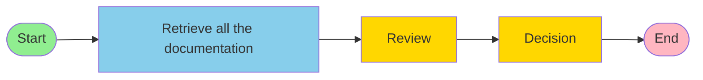
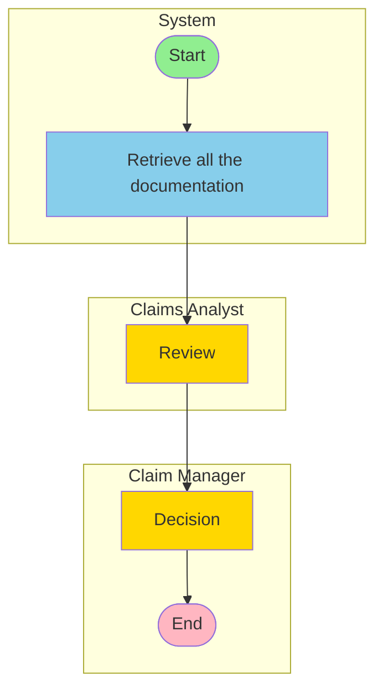
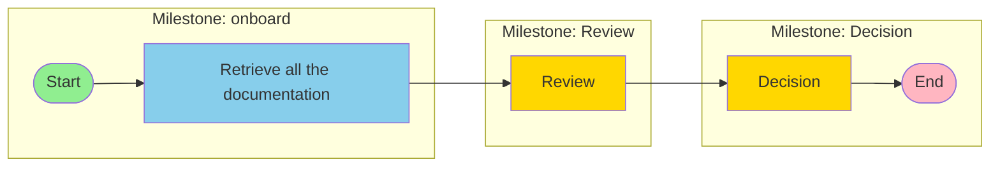
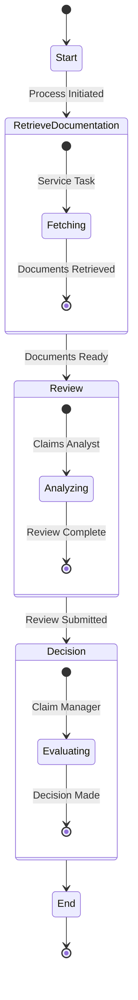
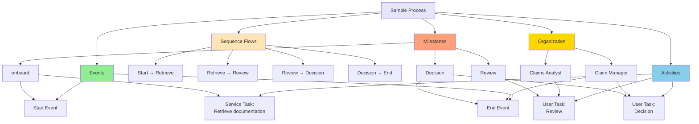
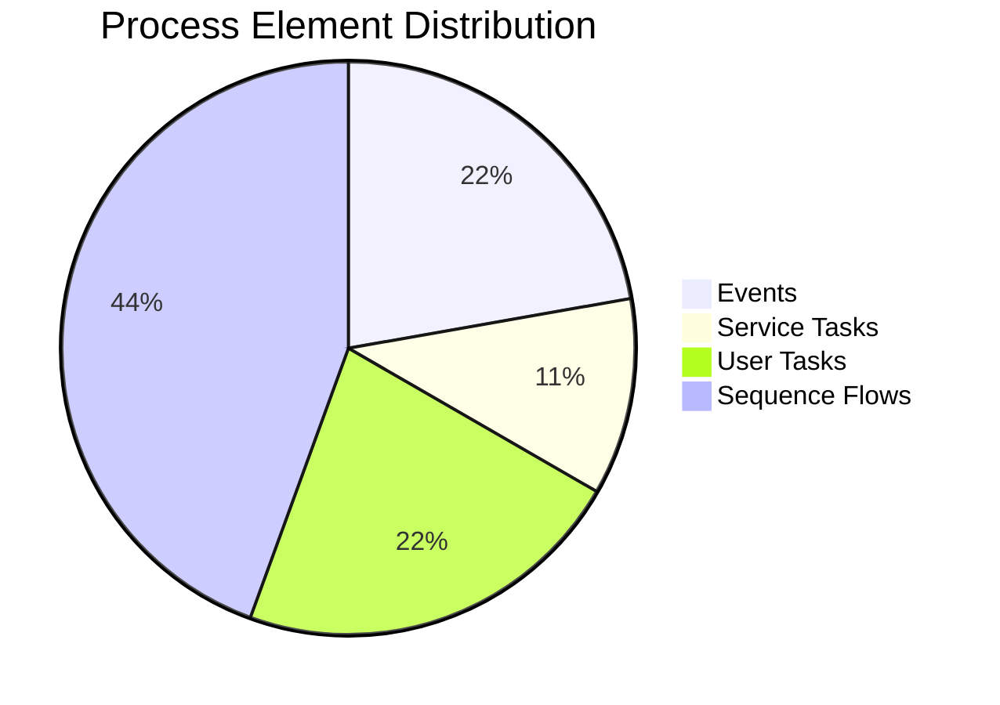
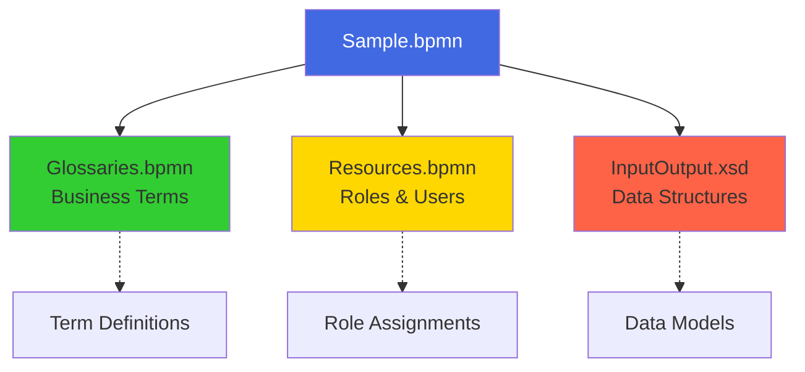

# Sample.bpmn - Visual Representations

## 1. Process Flow Diagram (Mermaid)



## 2. Swimlane Diagram with Roles



## 3. Milestone-Based View



## 4. Detailed Activity Diagram



## 5. BPMN Element Hierarchy



## 6. Data Flow Perspective

```mermaid
graph LR
    Input[Process Input] --> Start([Start])
    Start --> Retrieve[Retrieve all<br/>the documentation]
    Retrieve --> Docs[Documentation<br/>Package]
    Docs --> Review[Review]
    Review --> Analysis[Review<br/>Analysis]
    Analysis --> Decision[Decision]
    Decision --> Outcome[Decision<br/>Outcome]
    Outcome --> End([End])
    End --> Output[Process Output]
    
    style Input fill:#E0E0E0
    style Output fill:#E0E0E0
    style Docs fill:#B0E0E6
    style Analysis fill:#B0E0E6
    style Outcome fill:#B0E0E6
```



## 7. Timeline View

```mermaid
gantt
    title Sample Process Timeline
    dateFormat X
    axisFormat %s
    
    section System
    Start Event           :milestone, 0, 0
    Retrieve documentation :active, 0, 1
    
    section Claims Analyst
    Review               :active, 1, 2
    
    section Claim Manager
    Decision             :active, 2, 3
    End Event            :milestone, 3, 3
```



## 8. Responsibility Matrix (RACI)

| Activity | Claim Manager | Claims Analyst | System |
|----------|---------------|----------------|--------|
| **Start** | I | I | R |
| **Retrieve documentation** | I | I | R |
| **Review** | I | R/A | C |
| **Decision** | R/A | I | C |
| **End** | A | I | R |

**Legend:**
- R = Responsible (does the work)
- A = Accountable (final approval)
- C = Consulted (provides input)
- I = Informed (kept updated)

## 9. Process Complexity Metrics



## 10. Integration Points



## 11. Process Metrics Summary

| Metric | Value |
|--------|-------|
| **Total Activities** | 3 |
| **Automated Tasks** | 1 (33%) |
| **Manual Tasks** | 2 (67%) |
| **Decision Points** | 0 |
| **Parallel Paths** | 0 |
| **Process Complexity** | Low (Linear) |
| **Roles Involved** | 2 |
| **Milestones** | 3 |
| **Average Path Length** | 5 steps |

## 12. Quick Reference Card

### Process Summary
- **Name**: Sample
- **Type**: Claims Processing
- **Pattern**: Sequential Linear Flow
- **Automation Level**: Low (1/3 automated)

### Key Participants
1. **System** - Initiates and retrieves documentation
2. **Claims Analyst** - Reviews documentation
3. **Claim Manager** - Makes final decision

### Critical Path
```
Start → Retrieve (automated) → Review (manual) → Decision (manual) → End
```

### Estimated Duration
- Retrieve documentation: Automated (seconds/minutes)
- Review: Manual (hours/days)
- Decision: Manual (hours/days)

### Success Criteria
- All documentation retrieved successfully
- Review completed by Claims Analyst
- Decision made by Claim Manager
- Process reaches End event
