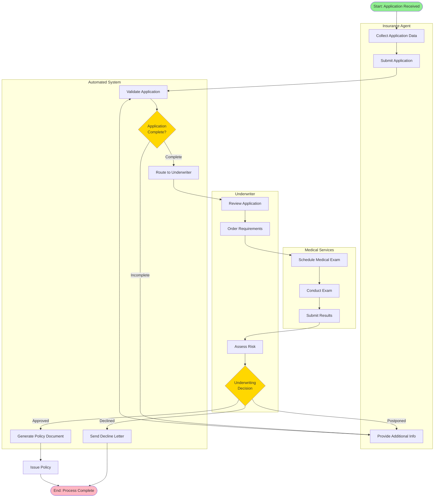

# New Business Application Process

## Process Overview

**Process ID:** `new-business-application`  
**Business Context:** LifeInsuranceAndAnnuities  
**Process Type:** End-to-End Business Process  
**Estimated Duration:** 2-4 weeks  
**Complexity:** High

### Purpose
This process manages the complete lifecycle of a new insurance or annuity application from initial submission through policy issuance or decline. It coordinates activities across multiple actors including insurance agents, automated systems, underwriters, and medical services to evaluate risk and make underwriting decisions.

### Scope
- **Starts with:** Agent submits completed application
- **Ends with:** Policy issued or application declined
- **Includes:** Application validation, requirements gathering, medical underwriting, risk assessment, decision-making, policy issuance
- **Excludes:** Post-issuance policy administration, premium collection, claims processing

---

## Process Diagram



---

## Process Steps

### 1. Collect Application Data
- **Actor:** Insurance Agent
- **Activity Type:** User Task
- **Description:** Agent collects comprehensive information from the applicant including personal details, coverage requirements, beneficiary information, and medical history.
- **Input Data:** 
  - Customer information (manual entry)
  - Product selection
- **Output Data:**
  - [`Application`](../../business-objects/generated/LifeInsuranceAndAnnuities/Application.json)
  - [`Policyholder`](../../business-objects/generated/LifeInsuranceAndAnnuities/Policyholder.json)
  - [`Insured`](../../business-objects/generated/LifeInsuranceAndAnnuities/Insured.json)
  - [`Beneficiary`](../../business-objects/generated/LifeInsuranceAndAnnuities/Beneficiary.json) (list)
- **Business Rules:**
  - Applicant must be at least 18 years old
  - All required fields must be completed
  - At least one primary beneficiary required
  - Total beneficiary percentages must equal 100%

### 2. Submit Application
- **Actor:** Insurance Agent
- **Activity Type:** User Task
- **Description:** Agent reviews collected information and submits the application to the system for processing.
- **Input Data:**
  - [`Application`](../../business-objects/generated/LifeInsuranceAndAnnuities/Application.json)
  - [`Agent`](../../business-objects/generated/LifeInsuranceAndAnnuities/Agent.json)
- **Output Data:**
  - Application submission confirmation
- **Business Rules:**
  - Agent must have valid license
  - Application must pass initial completeness check

### 3. Validate Application
- **Actor:** System
- **Activity Type:** Service Task
- **Description:** Automated validation of application data for completeness, format correctness, and basic eligibility criteria.
- **Input Data:**
  - [`Application`](../../business-objects/generated/LifeInsuranceAndAnnuities/Application.json)
- **Output Data:**
  - Validation results
  - Error list (if any)
- **Business Rules:**
  - All required fields must be present
  - Data format validation (SSN, dates, phone numbers)
  - Age within product limits (18-85 years)
  - Coverage amount within product limits
  - Valid state for product offering

### 4. Application Completeness Decision
- **Actor:** System
- **Decision Type:** Exclusive Gateway
- **Description:** Determines if the application contains all required information to proceed to underwriting.
- **Conditions:**
  - **Complete:** All validations passed, no missing required fields
  - **Incomplete:** Missing required information or validation failures
- **Business Logic:**
  ```
  IF all_required_fields_present 
     AND all_format_validations_passed 
     AND age_within_limits 
     AND coverage_within_limits 
  THEN route_to_underwriter
  ELSE return_to_agent_for_corrections
  ```

### 5. Route to Underwriter
- **Actor:** System
- **Activity Type:** Service Task
- **Description:** Assigns the application to an available underwriter based on workload, expertise, and product type.
- **Input Data:**
  - [`Application`](../../business-objects/generated/LifeInsuranceAndAnnuities/Application.json)
- **Output Data:**
  - Underwriter assignment
- **Business Rules:**
  - Route based on coverage amount thresholds
  - Consider underwriter specialization
  - Balance workload across team

### 6. Review Application
- **Actor:** Underwriter
- **Activity Type:** User Task
- **Description:** Underwriter performs initial review of the application to determine what additional requirements are needed for risk assessment.
- **Input Data:**
  - [`Application`](../../business-objects/generated/LifeInsuranceAndAnnuities/Application.json)
  - [`Insured`](../../business-objects/generated/LifeInsuranceAndAnnuities/Insured.json)
  - [`MedicalHistory`](../../business-objects/generated/LifeInsuranceAndAnnuities/MedicalHistory.json)
- **Output Data:**
  - [`Requirement`](../../business-objects/generated/LifeInsuranceAndAnnuities/Requirement.json) (list)
- **Business Rules:**
  - Medical exam required for coverage > $500,000
  - Attending Physician Statement required for disclosed conditions
  - Financial documents required for high coverage amounts

### 7. Order Requirements
- **Actor:** Underwriter
- **Activity Type:** User Task
- **Description:** Underwriter orders necessary requirements such as medical exams, physician statements, or financial documents.
- **Input Data:**
  - [`Requirement`](../../business-objects/generated/LifeInsuranceAndAnnuities/Requirement.json) (list)
- **Output Data:**
  - Requirement orders sent
- **Business Rules:**
  - Requirements must be completed within specified timeframes
  - Automated reminders for pending requirements

### 8. Medical Underwriting Subprocess
- **Actor:** Medical Services, Underwriter
- **Activity Type:** Subprocess
- **Description:** Comprehensive medical evaluation including exam scheduling, exam completion, and results submission.
- **Input Data:**
  - [`Application`](../../business-objects/generated/LifeInsuranceAndAnnuities/Application.json)
  - [`Insured`](../../business-objects/generated/LifeInsuranceAndAnnuities/Insured.json)
  - [`Requirement`](../../business-objects/generated/LifeInsuranceAndAnnuities/Requirement.json)
- **Output Data:**
  - Medical exam results
  - [`MedicalRating`](../../business-objects/generated/LifeInsuranceAndAnnuities/MedicalRating.json)
- **Business Rules:**
  - Exam must be completed within 90 days
  - Results must be reviewed by licensed medical professional

### 9. Assess Risk
- **Actor:** Underwriter
- **Activity Type:** User Task
- **Description:** Underwriter evaluates all gathered information to assess the risk and determine appropriate risk classification.
- **Input Data:**
  - [`Application`](../../business-objects/generated/LifeInsuranceAndAnnuities/Application.json)
  - [`Insured`](../../business-objects/generated/LifeInsuranceAndAnnuities/Insured.json)
  - [`MedicalHistory`](../../business-objects/generated/LifeInsuranceAndAnnuities/MedicalHistory.json)
  - Medical exam results
  - [`MedicalRating`](../../business-objects/generated/LifeInsuranceAndAnnuities/MedicalRating.json)
- **Output Data:**
  - Risk assessment
  - Recommended risk class
- **Business Rules:**
  - Consider age, health, occupation, lifestyle factors
  - Apply underwriting guidelines
  - Document rationale for risk classification

### 10. Underwriting Decision
- **Actor:** Underwriter
- **Decision Type:** Exclusive Gateway
- **Description:** Final underwriting decision on the application based on risk assessment.
- **Conditions:**
  - **Approved:** Risk is acceptable, issue policy as applied or with modifications
  - **Declined:** Risk is too high, decline application
  - **Postponed:** Need additional information or time for conditions to improve
- **Business Logic:**
  ```
  IF risk_class IN [PREFERRED_PLUS, PREFERRED, STANDARD_PLUS, STANDARD] 
     AND no_unacceptable_conditions 
     AND all_requirements_satisfied 
  THEN approve_application
  ELSE IF unresolved_requirements OR temporary_conditions 
  THEN postpone_decision
  ELSE decline_application
  ```

### 11. Generate Policy Document
- **Actor:** System
- **Activity Type:** Service Task
- **Description:** Automated generation of policy document with approved terms and conditions.
- **Input Data:**
  - [`Application`](../../business-objects/generated/LifeInsuranceAndAnnuities/Application.json)
  - [`UnderwritingDecision`](../../business-objects/generated/LifeInsuranceAndAnnuities/UnderwritingDecision.json)
- **Output Data:**
  - [`Policy`](../../business-objects/generated/LifeInsuranceAndAnnuities/Policy.json)
  - [`Document`](../../business-objects/generated/LifeInsuranceAndAnnuities/Document.json) (policy document)
- **Business Rules:**
  - Policy number must be unique
  - Include all approved riders and modifications
  - Generate in compliance with state regulations

### 12. Issue Policy
- **Actor:** System
- **Activity Type:** Service Task
- **Description:** Final policy issuance including delivery to policyholder and agent notification.
- **Input Data:**
  - [`Policy`](../../business-objects/generated/LifeInsuranceAndAnnuities/Policy.json)
- **Output Data:**
  - Policy issued confirmation
  - Policy delivery tracking
- **Business Rules:**
  - Initial premium must be received
  - Policy effective date set appropriately
  - Notify all relevant parties

---

## Business Objects

This process uses the following business objects:

| Business Object | Usage | Activities |
|----------------|-------|-----------|
| [`Application`](../../business-objects/generated/LifeInsuranceAndAnnuities/Application.json) | Input/Output | All activities |
| [`Policyholder`](../../business-objects/generated/LifeInsuranceAndAnnuities/Policyholder.json) | Input | Collect Application Data, Validate Application |
| [`Insured`](../../business-objects/generated/LifeInsuranceAndAnnuities/Insured.json) | Input | Collect Application Data, Review Application, Medical Underwriting |
| [`Beneficiary`](../../business-objects/generated/LifeInsuranceAndAnnuities/Beneficiary.json) | Input | Collect Application Data |
| [`Agent`](../../business-objects/generated/LifeInsuranceAndAnnuities/Agent.json) | Input | Submit Application |
| [`Requirement`](../../business-objects/generated/LifeInsuranceAndAnnuities/Requirement.json) | Output | Order Requirements |
| [`MedicalHistory`](../../business-objects/generated/LifeInsuranceAndAnnuities/MedicalHistory.json) | Input | Review Application, Assess Risk |
| [`MedicalRating`](../../business-objects/generated/LifeInsuranceAndAnnuities/MedicalRating.json) | Output | Medical Underwriting, Assess Risk |
| [`UnderwritingDecision`](../../business-objects/generated/LifeInsuranceAndAnnuities/UnderwritingDecision.json) | Output | Underwriting Decision, Generate Policy |
| [`Policy`](../../business-objects/generated/LifeInsuranceAndAnnuities/Policy.json) | Output | Generate Policy, Issue Policy |
| [`Document`](../../business-objects/generated/LifeInsuranceAndAnnuities/Document.json) | Output | Generate Policy |

---

## Business Rules

### Validation Rules
1. **Age Eligibility:** Applicant must be between 18 and 85 years old at application
2. **Coverage Limits:** Requested coverage must be within product-specific limits
3. **Beneficiary Requirements:** At least one primary beneficiary required, percentages must total 100%
4. **Medical Exam Threshold:** Medical exam required for coverage amounts exceeding $500,000
5. **State Licensing:** Product must be approved for sale in applicant's state of residence

### Decision Rules
1. **Automatic Approval Criteria:**
   - Standard or better risk class
   - No significant medical conditions
   - Coverage amount < $250,000
   - Age < 60 years
   - Non-tobacco user

2. **Automatic Decline Criteria:**
   - High-risk occupation without mitigation
   - Serious uncontrolled medical conditions
   - Age > 80 years
   - Requested coverage exceeds maximum for age/health

3. **Manual Review Required:**
   - All cases not meeting automatic approval or decline criteria
   - Any disclosed medical conditions
   - High coverage amounts relative to income
   - Occupation with elevated risk

### Underwriting Guidelines
1. **Risk Classification Factors:**
   - Age and gender
   - Medical history and current health
   - Tobacco use
   - Occupation and avocations
   - Driving record
   - Family medical history

2. **Requirement Ordering:**
   - Medical exam for coverage > $500,000
   - Attending Physician Statement for disclosed conditions
   - Financial documents for coverage > 10x annual income
   - Motor Vehicle Report for certain occupations

---

## Integration Points

| Integration | Type | Activity | Description |
|------------|------|----------|-------------|
| MIB (Medical Information Bureau) | API | Review Application | Check applicant's medical history across insurers |
| Prescription Database | API | Review Application | Verify current and past medications |
| MVR Service | API | Assess Risk | Obtain motor vehicle records |
| Credit Bureau | API | Assess Risk | Financial underwriting for high coverage amounts |
| Medical Exam Provider | Service | Medical Underwriting | Schedule and conduct medical examinations |
| Payment Gateway | API | Issue Policy | Process initial premium payment |
| Document Management System | Service | Generate Policy | Store and retrieve policy documents |
| Email/SMS Service | API | Multiple | Notifications to applicant, agent, underwriter |

---

## Exception Handling

### Error Scenarios

1. **Incomplete Application Submission**
   - **Trigger:** Missing required fields or invalid data
   - **Handling:** Return to agent with specific error messages
   - **Recovery:** Agent corrects and resubmits

2. **Medical Exam Not Completed**
   - **Trigger:** Exam not completed within 90-day window
   - **Handling:** Send reminders, then postpone application
   - **Recovery:** Reschedule exam or decline if too much time elapsed

3. **Underwriter Unavailable**
   - **Trigger:** No underwriters available for assignment
   - **Handling:** Queue application, notify management
   - **Recovery:** Assign when underwriter becomes available

4. **System Integration Failure**
   - **Trigger:** External service (MIB, MVR, etc.) unavailable
   - **Handling:** Retry with exponential backoff, manual fallback
   - **Recovery:** Complete requirement manually or postpone

5. **Premium Payment Failure**
   - **Trigger:** Initial premium payment declined
   - **Handling:** Notify applicant and agent, hold policy issuance
   - **Recovery:** Retry payment or cancel application

---

## Performance Metrics

### Key Performance Indicators
- **Average Processing Time:** Target 2-4 weeks from submission to decision
- **Straight-Through Processing Rate:** Percentage of applications approved without manual intervention
- **Decline Rate:** Percentage of applications declined
- **Postponement Rate:** Percentage of applications postponed
- **Requirement Completion Time:** Average time to complete medical exams and other requirements

### Service Level Agreements
- **Initial Review:** Within 2 business days of submission
- **Requirement Ordering:** Within 1 business day of review completion
- **Final Decision:** Within 5 business days of all requirements received
- **Policy Issuance:** Within 2 business days of approval

---

## Process Metadata

```json
{
  "processId": "new-business-application",
  "processName": "New Business Application Process",
  "version": "1.0.0",
  "context": "LifeInsuranceAndAnnuities",
  "processType": "end-to-end",
  "actors": [
    {
      "id": "agent",
      "name": "Insurance Agent",
      "type": "human",
      "role": "Collects application data and submits to system"
    },
    {
      "id": "system",
      "name": "BAW System",
      "type": "system",
      "role": "Validates data, routes work, generates documents"
    },
    {
      "id": "underwriter",
      "name": "Underwriter",
      "type": "human",
      "role": "Reviews applications, assesses risk, makes decisions"
    },
    {
      "id": "medical",
      "name": "Medical Services",
      "type": "human",
      "role": "Conducts medical exams and provides results"
    }
  ],
  "activities": [
    {
      "id": "collect_app",
      "name": "Collect Application Data",
      "type": "userTask",
      "actor": "agent",
      "description": "Agent collects comprehensive applicant information",
      "inputData": [],
      "outputData": ["Application", "Policyholder", "Insured", "Beneficiary"]
    },
    {
      "id": "submit_app",
      "name": "Submit Application",
      "type": "userTask",
      "actor": "agent",
      "description": "Agent submits completed application",
      "inputData": ["Application", "Agent"],
      "outputData": ["Application"]
    },
    {
      "id": "validate_app",
      "name": "Validate Application",
      "type": "serviceTask",
      "actor": "system",
      "description": "Automated validation of application data",
      "inputData": ["Application"],
      "outputData": ["ValidationResults"]
    },
    {
      "id": "route_underwriter",
      "name": "Route to Underwriter",
      "type": "serviceTask",
      "actor": "system",
      "description": "Assign application to underwriter",
      "inputData": ["Application"],
      "outputData": ["UnderwriterAssignment"]
    },
    {
      "id": "review_app",
      "name": "Review Application",
      "type": "userTask",
      "actor": "underwriter",
      "description": "Initial underwriter review",
      "inputData": ["Application", "Insured", "MedicalHistory"],
      "outputData": ["Requirement"]
    },
    {
      "id": "assess_risk",
      "name": "Assess Risk",
      "type": "userTask",
      "actor": "underwriter",
      "description": "Comprehensive risk assessment",
      "inputData": ["Application", "Insured", "MedicalHistory", "MedicalRating"],
      "outputData": ["RiskAssessment"]
    },
    {
      "id": "generate_policy",
      "name": "Generate Policy Document",
      "type": "serviceTask",
      "actor": "system",
      "description": "Create policy document",
      "inputData": ["Application", "UnderwritingDecision"],
      "outputData": ["Policy", "Document"]
    },
    {
      "id": "issue_policy",
      "name": "Issue Policy",
      "type": "serviceTask",
      "actor": "system",
      "description": "Final policy issuance",
      "inputData": ["Policy"],
      "outputData": ["PolicyIssuanceConfirmation"]
    }
  ],
  "gateways": [
    {
      "id": "gw_complete",
      "name": "Application Complete?",
      "type": "exclusive",
      "conditions": [
        {
          "path": "complete",
          "condition": "all_required_fields_present AND all_validations_passed"
        },
        {
          "path": "incomplete",
          "condition": "missing_fields OR validation_failures"
        }
      ]
    },
    {
      "id": "gw_decision",
      "name": "Underwriting Decision",
      "type": "exclusive",
      "conditions": [
        {
          "path": "approved",
          "condition": "risk_acceptable AND requirements_satisfied"
        },
        {
          "path": "declined",
          "condition": "risk_too_high OR unacceptable_conditions"
        },
        {
          "path": "postponed",
          "condition": "unresolved_requirements OR temporary_conditions"
        }
      ]
    }
  ],
  "dataObjects": [
    {
      "id": "Application",
      "name": "Application",
      "path": "business-objects/generated/LifeInsuranceAndAnnuities/Application.json"
    },
    {
      "id": "Policy",
      "name": "Policy",
      "path": "business-objects/generated/LifeInsuranceAndAnnuities/Policy.json"
    },
    {
      "id": "UnderwritingDecision",
      "name": "Underwriting Decision",
      "path": "business-objects/generated/LifeInsuranceAndAnnuities/UnderwritingDecision.json"
    }
  ],
  "integrations": [
    {
      "name": "MIB",
      "type": "API",
      "activity": "review_app",
      "description": "Medical Information Bureau check"
    },
    {
      "name": "Prescription Database",
      "type": "API",
      "activity": "review_app",
      "description": "Prescription history verification"
    },
    {
      "name": "Payment Gateway",
      "type": "API",
      "activity": "issue_policy",
      "description": "Process initial premium payment"
    }
  ],
  "estimatedDuration": "2-4 weeks",
  "complexity": "high",
  "generatedFrom": "business-blueprints/LifeInsuranceAndAnnuities-2.pdf",
  "generatedDate": "2026-05-06T10:30:00Z",
  "bpmnPreparation": {
    "readyForBPMN": true,
    "mappingNotes": "Process structure is ready for BPMN conversion. Activities map to BPMN tasks, gateways map to BPMN gateways, actors map to pools/lanes."
  }
}
```

---

**Generated by:** BAW Blueprint Parser Mode  
**Source Document:** business-blueprints/LifeInsuranceAndAnnuities-2.pdf  
**Last Updated:** 2026-05-06T10:30:00Z  
**Version:** 1.0.0