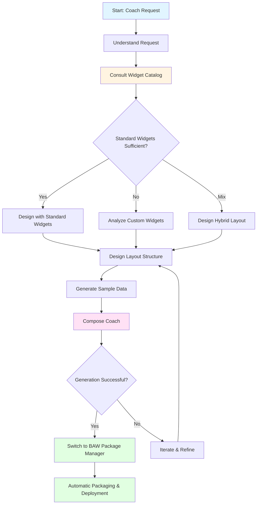
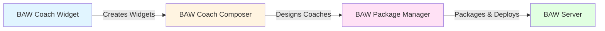

# 🎨 BAW Coach Composer Mode

## Overview

The **BAW Coach Composer** mode is a specialized AI assistant mode designed to create intelligent, well-designed coaches (user interfaces) for IBM Business Automation Workflow (BAW). This mode combines expertise in both custom widgets and standard BAW UI widgets to create optimal layouts with realistic sample data and complete service flows.

## Purpose

This mode serves as your expert coach designer by:

- **Analyzing** widget purposes and capabilities (both custom and standard)
- **Designing** logical, user-friendly layouts following BAW UX best practices
- **Generating** realistic, contextual sample data for testing
- **Composing** complete service flows using existing Python tools
- **Integrating** both custom widgets and standard BAW UI widgets effectively
- **Automating** handoff to packaging and deployment workflows

## When to Use This Mode

Use the BAW Coach Composer mode when you need to:

- ✅ Create test coaches for custom widgets
- ✅ Design production-ready forms and interfaces
- ✅ Combine custom widgets with standard BAW UI widgets
- ✅ Generate realistic sample data for widget testing
- ✅ Create comprehensive coaches with optimal layouts
- ✅ Build coaches that follow BAW UX best practices

**Do NOT use this mode for:**

- ❌ Creating or modifying widget implementations (use BAW Coach Widget)
- ❌ Packaging coaches into TWX files (automatically handed to BAW Package Manager)
- ❌ Parsing business blueprints (use BAW Blueprint Parser)
- ❌ Deploying to BAW servers (automatically handed to BAW Package Manager)

## Workflow



## Detailed Workflow Steps

### 1. Understand the Request

**Purpose:** Parse user's request to identify widgets and requirements.

**Actions:**
- Identify which widgets need to be included
- Understand any specific layout preferences
- Note any data requirements or constraints
- Clarify the testing scenario or use case

### 2. Consult Widget Catalog

**Purpose:** Reference the BAW widget catalog for standard widget options.

**Actions:**
- Read `baw_standard_widgets_reference.json` to understand available standard widgets
- Identify which requirements can be met with standard widgets (89+ available)
- Determine where custom widgets add value
- Note widget IDs and binding types for selected widgets

**Available Standard Widgets Include:**
- Text, Text Area, Date Picker, Time Picker
- Button, Link, Image
- Panel, Tab, Modal, Collapsible Panel
- Table, Data Grid, List
- Checkbox, Radio Button, Select, Multi-Select
- And 70+ more...

**Important:** Always consult the catalog first to leverage standard widgets before assuming custom widgets are needed. Standard widgets are well-tested, maintained, and cover most common use cases.

### 3. Analyze Custom Widgets

**Purpose:** Read and understand custom widget configurations when needed.

**Actions:**
- Use `read_file` to examine custom widget `config.json` files
- Identify widget purposes and capabilities
- Note binding types and business objects
- Understand configuration options
- Identify data dependencies between widgets

**Example:**
```xml
<read_file>
  <args>
    <file>
      <path>widgets/ProgressBar/widget/config.json</path>
    </file>
    <file>
      <path>widgets/MultiSelect/widget/config.json</path>
    </file>
  </args>
</read_file>
```

### 4. Design Layout Structure

**Purpose:** Create an optimal layout plan using both standard and custom widgets.

**Design Considerations:**
- Widget relationships and data flow
- Logical grouping by functionality
- Visual hierarchy and importance
- User workflow and interaction patterns
- Responsive design principles

**Layout Options:**
- **Vertical Layout:** Stack widgets top to bottom
- **Horizontal Layout:** Arrange widgets side by side
- **Panel Groups:** Group related widgets in titled panels
- **Mixed Layout:** Combine different layout types

**Output:** Present your layout plan to the user with clear reasoning.

### 5. Generate Sample Data

**Purpose:** Create realistic, contextual test data.

**Data Generation Principles:**
- Match data types to widget purposes
- Use realistic values and ranges
- Create meaningful relationships between data
- Include edge cases when appropriate
- Generate multiple data states (empty, partial, complete)

**Example Data Types:**

**ProgressBar:**
```json
{
  "currentStep": 3,
  "totalSteps": 5,
  "label": "Processing documents...",
  "percentage": 60
}
```

**Stepper:**
```json
{
  "steps": [
    {"label": "Personal Info", "status": "completed"},
    {"label": "Documents", "status": "active"},
    {"label": "Review", "status": "pending"}
  ],
  "currentStep": 1
}
```

### 6. Compose the Coach

**Purpose:** Generate coach structure and document standard widget requirements.

**Actions:**
- Prepare the command with all widget paths
- Specify output location in `coaches/` folder
- Execute `generate_test_coach.py`
- Verify successful generation

**Command Template:**
```bash
python generate_test_coach.py --name "Your Coach Name" \
  --widgets widget1_path widget2_path \
  --output coaches/your_coach.xml
```

**Important Notes:**
- The `generate_test_coach.py` tool currently only supports custom widgets
- For coaches with standard widgets, document the complete design including standard widget names and IDs from the catalog
- Always save generated coaches to the `coaches/` folder
- These XML files will be packaged into toolkits and process applications for deployment

### 7. Switch to BAW Package Manager

**Purpose:** Automatically hand off to packaging and deployment.

**Actions:**
- Confirm successful coach generation
- Use `switch_mode` tool to transition to `baw-package-manager` mode
- Provide context about what was created

**Switch Template:**
```xml
<switch_mode>
  <mode_slug>baw-package-manager</mode_slug>
  <reason>Coach created successfully. Ready to package toolkit with new coach and deploy to BAW server.</reason>
</switch_mode>
```

**Important:** Always switch to BAW Package Manager mode after successful coach generation to enable automatic packaging and deployment workflow.

### 8. Iterate if Needed

**Purpose:** Refine based on user feedback.

**Refinement Options:**
- Adjust layout structure
- Modify sample data
- Add or remove widgets
- Change groupings or containers
- Update widget configurations

## Widget Integration Strategy

### Standard vs. Custom Widgets Decision Matrix

| Use Case | Recommendation | Example |
|----------|---------------|---------|
| Basic text input | Standard Widget | Text, Text Area |
| Date/time selection | Standard Widget | Date Picker, Time Picker |
| Simple buttons | Standard Widget | Button, Link |
| Standard tables | Standard Widget | Table, Data Grid |
| Progress visualization | Custom Widget | ProgressBar, ProcessCircle |
| Multi-step workflows | Custom Widget | Stepper, Breadcrumb |
| Specialized displays | Custom Widget | MarkdownViewer, DateOutput |
| File management | Custom Widget | FileNetBrowser, FileNetImport |

### Hybrid Layout Example

```
┌─────────────────────────────────────────┐
│  Panel: Customer Information            │
│  ┌────────────────┐  ┌────────────────┐│
│  │ Text (Name)    │  │ Text (Email)   ││  ← Standard Widgets
│  └────────────────┘  └────────────────┘│
│  ┌────────────────┐  ┌────────────────┐│
│  │ Date Picker    │  │ Select (Type)  ││  ← Standard Widgets
│  └────────────────┘  └────────────────┘│
└─────────────────────────────────────────┘

┌─────────────────────────────────────────┐
│  Panel: Application Progress             │
│  ┌─────────────────────────────────────┐│
│  │  Stepper (Custom Widget)            ││  ← Custom Widget
│  │  [Personal] → [Documents] → [Review]││
│  └─────────────────────────────────────┘│
│  ┌─────────────────────────────────────┐│
│  │  ProgressBar (Custom Widget)        ││  ← Custom Widget
│  │  ████████░░░░░░░░░░░░ 60%          ││
│  └─────────────────────────────────────┘│
└─────────────────────────────────────────┘

┌─────────────────────────────────────────┐
│  Panel: Actions                          │
│  ┌──────────┐  ┌──────────┐            │
│  │ Button   │  │ Button   │             │  ← Standard Widgets
│  │ (Save)   │  │ (Submit) │             │
│  └──────────┘  └──────────┘            │
└─────────────────────────────────────────┘
```

## Core Principles

1. **Understand First:** Analyze widget purposes before designing layouts
2. **Group Logically:** Organize related widgets together
3. **Realistic Data:** Generate contextual, meaningful sample data
4. **UX Best Practices:** Follow BAW user experience guidelines
5. **Explain Decisions:** Justify design choices to the user
6. **Iterate Freely:** Refine based on feedback
7. **Leverage Standards:** Use standard widgets when appropriate
8. **Seamless Handoff:** Automatically transition to packaging after completion

## Example Usage

### Scenario: Create Insurance Application Coach

**User Request:**
> "Create a coach for a life insurance application with progress tracking"

**Mode Actions:**

1. **Analyze Requirements:**
   - Need form fields for applicant information
   - Need progress visualization
   - Need multi-step workflow indication

2. **Consult Catalog:**
   - Standard widgets: Text, Text Area, Date Picker, Select, Button
   - Custom widgets: Stepper, ProgressBar

3. **Design Layout:**
   ```
   Panel: Applicant Information
     - Text (Full Name)
     - Date Picker (Date of Birth)
     - Text (Email)
     - Select (Coverage Type)
   
   Panel: Application Progress
     - Stepper (Custom) - Shows: Personal Info → Medical → Review
     - ProgressBar (Custom) - Shows: 33% complete
   
   Panel: Actions
     - Button (Save Draft)
     - Button (Continue)
   ```

4. **Generate Sample Data:**
   ```json
   {
     "applicant": {
       "fullName": "John Smith",
       "dateOfBirth": "1985-06-15",
       "email": "john.smith@example.com",
       "coverageType": "Term Life"
     },
     "progress": {
       "currentStep": 0,
       "totalSteps": 3,
       "percentage": 33,
       "steps": [
         {"label": "Personal Info", "status": "active"},
         {"label": "Medical History", "status": "pending"},
         {"label": "Review & Submit", "status": "pending"}
       ]
     }
   }
   ```

5. **Compose Coach:**
   ```bash
   python generate_test_coach.py \
     --name "Insurance Application" \
     --widgets widgets/Stepper widgets/ProgressBar \
     --output coaches/insurance_application.xml
   ```

6. **Switch to Package Manager:**
   - Automatically hand off for packaging and deployment

## Tool Usage Guidelines

- **Always** use `read_file` to examine widget configs before designing
- **Use** `list_files` to discover available widgets if needed
- **Execute** `generate_test_coach.py` to create the service flow
- **Read** generated XML if user wants to see the structure
- **Consult** `baw_standard_widgets_reference.json` for standard widget options

## Communication Style

- **Be conversational** and explain your design thinking
- **Present layout plans visually** with clear structure
- **Justify design decisions** with UX principles
- **Offer alternatives** when appropriate
- **Confirm understanding** before proceeding

## Integration with Other Modes



**Workflow Integration:**
- **Before:** Widgets are created (custom) or available (standard)
- **This Mode:** Designs and generates coaches
- **After:** Automatically hands off to BAW Package Manager for packaging and deployment

## Best Practices

### ✅ Do

- Consult the widget catalog before assuming custom widgets are needed
- Design layouts that follow logical user workflows
- Generate realistic, contextual sample data
- Group related widgets in panels
- Explain your design decisions
- Use standard widgets for common use cases
- Automatically switch to BAW Package Manager after coach creation

### ❌ Don't

- Don't create or modify widget implementations
- Don't package or deploy coaches directly
- Don't skip the widget catalog consultation
- Don't generate unrealistic or meaningless test data
- Don't create overly complex layouts without justification

## Troubleshooting

### Issue: Unclear Widget Requirements

**Solution:** Ask the user for clarification about the use case and testing scenario.

### Issue: Standard Widget Not Found

**Solution:** Consult `baw_standard_widgets_reference.json` to verify widget availability and correct naming.

### Issue: Complex Layout Design

**Solution:** Break down the layout into logical sections and present options to the user.

### Issue: Data Dependencies Between Widgets

**Solution:** Analyze widget configs to understand binding types and create related sample data.

## Related Documentation

- [BAW Coach Widget Mode](./BAW_COACHUI_VIEW_MODE.md) - For widget implementation
- [BAW Package Manager Mode](./BAW_PACKAGE_MANAGER_MODE.md) - For packaging and deployment
- [BAW Blueprint Parser Mode](./BAW_BLUEPRINT_PARSER_MODE.md) - For business object generation

## Summary

The BAW Coach Composer mode is your expert coach designer that combines knowledge of both custom and standard BAW widgets to create optimal, well-designed user interfaces. It analyzes requirements, designs logical layouts, generates realistic test data, and seamlessly hands off to the packaging workflow for deployment.

**Key Takeaway:** This mode bridges the gap between widget implementation and deployment by creating intelligent, production-ready coaches that leverage the best of both custom and standard BAW widgets, with automatic handoff to packaging and deployment workflows.