# Hands-On Lab: Building a Progress Bar Widget for IBM BAW

## Lab Overview

**Duration**: 45 minutes  
**Difficulty**: Intermediate  
**Prerequisites**: Basic knowledge of HTML, CSS, JavaScript, and IBM Business Automation Workflow (BAW)

### What You'll Build

A fully functional Progress Bar widget for IBM BAW with:
- Animated horizontal progress bar
- Percentage display
- Color-coded states (red/yellow/green)
- Data binding with BAW business objects
- Event handling for dynamic updates

### Learning Objectives

1. Create a custom BAW Coach View widget
2. Implement HTML, CSS, and JavaScript for widgets
3. Configure data binding and event handlers
4. Test widgets in BAW Process Designer

---

## Table of Contents

1. [Lab Setup (5 min)](#lab-setup-5-minutes)
2. [Part 1: Create Widget Files (10 min)](#part-1-create-widget-files-10-minutes)
3. [Part 2: Import to BAW (10 min)](#part-2-import-to-baw-10-minutes)
4. [Part 3: Test Your Widget (10 min)](#part-3-test-your-widget-10-minutes)
5. [Part 4: Understanding the Code (10 min)](#part-4-understanding-the-code-10-minutes)
6. [Next Steps](#next-steps)

---

## Lab Setup (5 minutes)

### Quick Start

1. **Clone the repository:**
```bash
git clone https://github.com/MalekJabri/BOB-BAW-Widget.git
cd BOB-BAW-Widget
mkdir -p ProgressBar/widget
cd ProgressBar/widget
```

2. **Open the folder with BOB**


### What You Need

- ✅ IBM BAW v25.0+
- ✅ Git installed
- ✅ Text editor (VS Code, Sublime, etc.)
- ✅ Modern web browser

---

## Part 1: Create Widget Files (10 minutes)

You'll create three essential files. Copy the code exactly as shown.

### 💬 Prompt to Bob (Switch to BAW Coach Widget)

```
Create a new widget called "My Progress Bar"
• Animated horizontal progress bar with smooth transitions
• Percentage display showing real-time progress
• Color-coded states that change automatically:
  - 🔴 Red (0-49%): Low progress
  - 🟡 Yellow (50-74%): Moderate progress
  - 🟢 Green (75-100%): High progress
• Status messages ("Not started", "In progress...", "Complete")
• Data binding with an integer variable
• Event handling for automatic updates
```

## Part 2: Import to BAW (10 minutes)

### Step 1: Open BAW Process Designer

1. Log into IBM Business Automation Studio
2. Open Workflow Designer
3. Create your Toolkit using your last name.


### Step 2: Create Custom View

1. Go to **User Interface** 
2. Click on + 
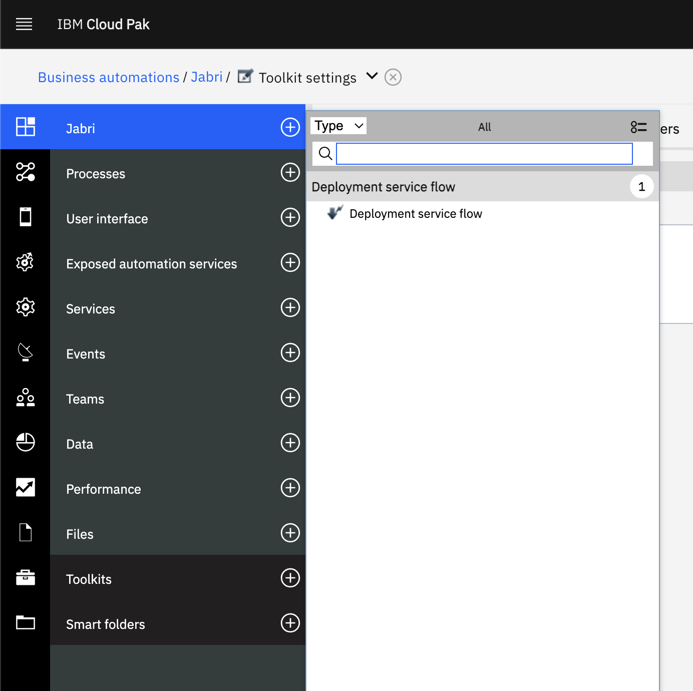
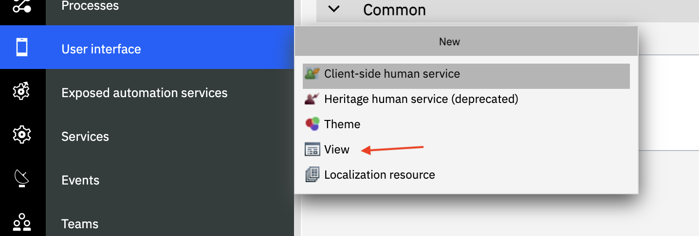

4. Name it: `My Progress Bar` and click Finish
5. Search for HTML in the widget panel and drag and drop the custom HTML widget
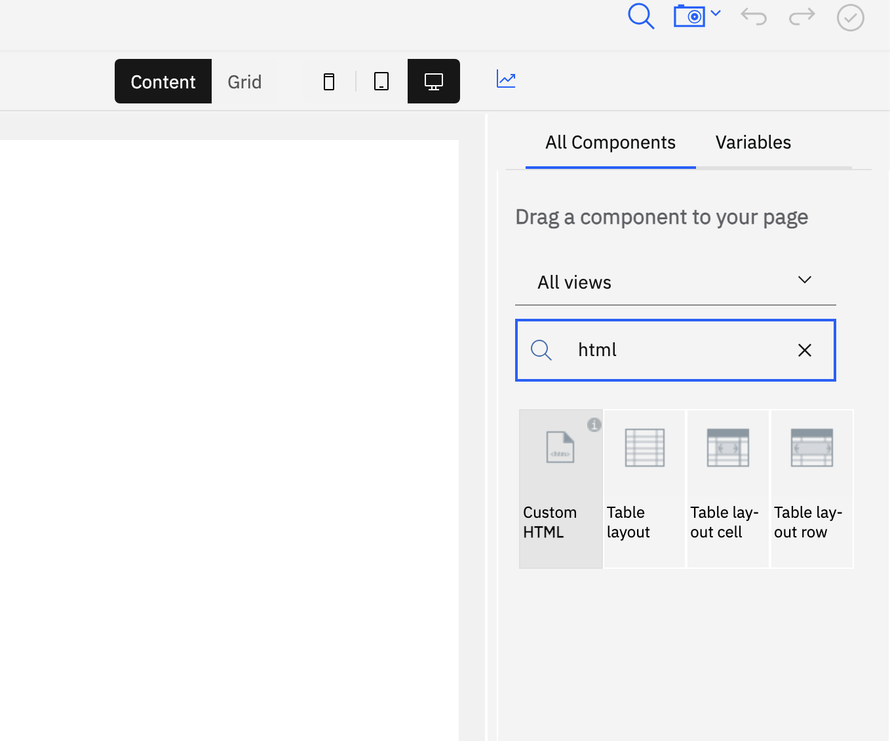


### Step 3: Paste Widget Code

Copy and paste each file into the corresponding tab:

| BAW Tab | Source File | Action |
|---------|-------------|--------|
| **HTML** | `Layout.html` | Copy entire content |
| **Inline CSS** | `InlineCSS.css` | Copy entire content |
| **Inline JavaScript** | `inlineJavascript.js` | Copy entire content |
| **onChange** | `eventHandler.md` | Copy Event Handler Code content |

***HTML***
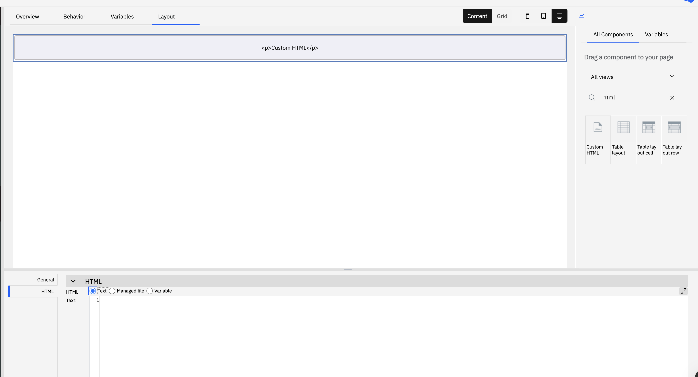

***Inline CSS***
 
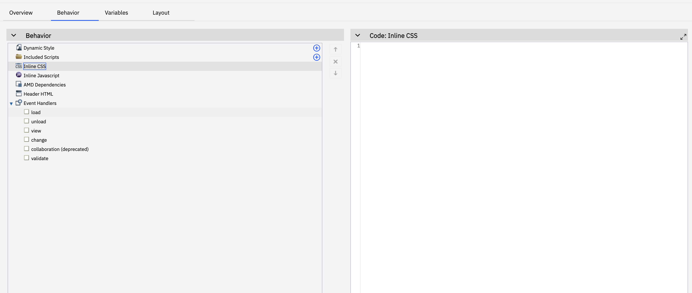

***Inline JavaScript***

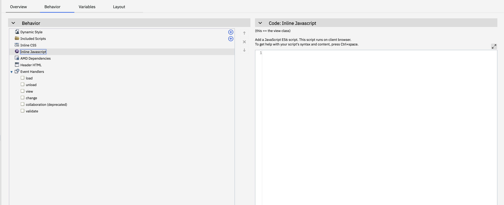

***onChange***


***
### Step 4: Add Configuration Options and Change Event Handler

1. Click the **Variables** tab
2. Add an item under **Business Data** and **Configuration Options** for each variable and event

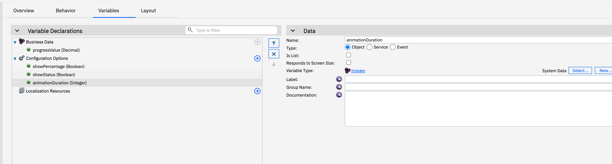


✅ **Checkpoint:** Widget is now imported into BAW!

---

## Part 3: Test Your Widget (10 minutes)

### Step 1: Create Test Coach

1. Create a new Coach View
2. Go to **User Interface** 
3. Click on + 
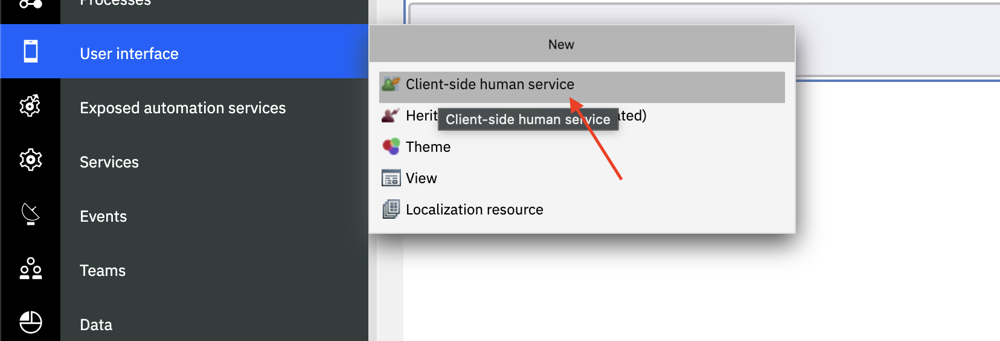

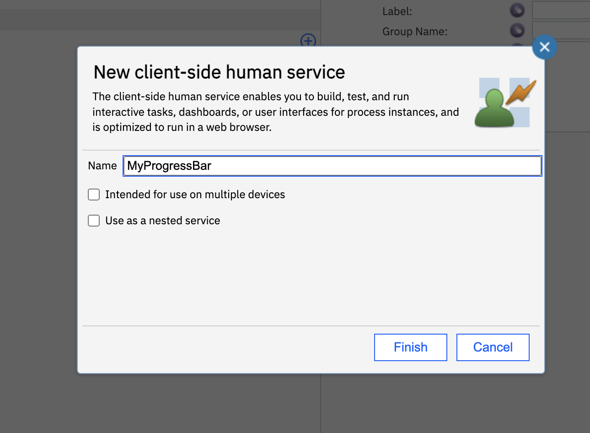

4. Drag the **Progress Bar** widget onto the coach (like you did with the Custom HTML)
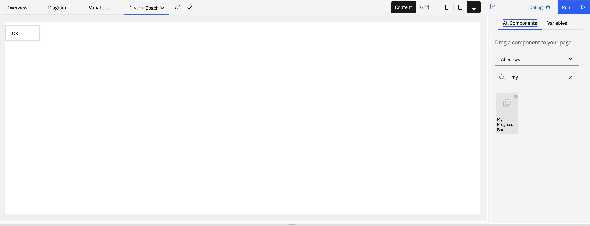
5. Create variable: 
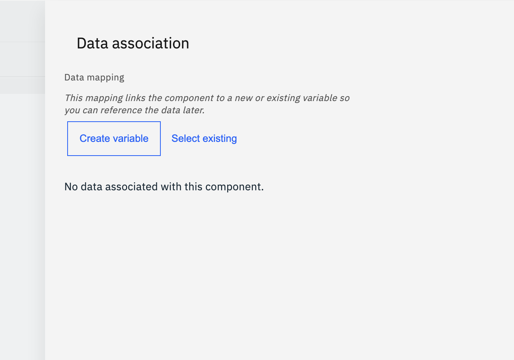


### Step 2: Add Test Controls

Add a Decimal Widget:

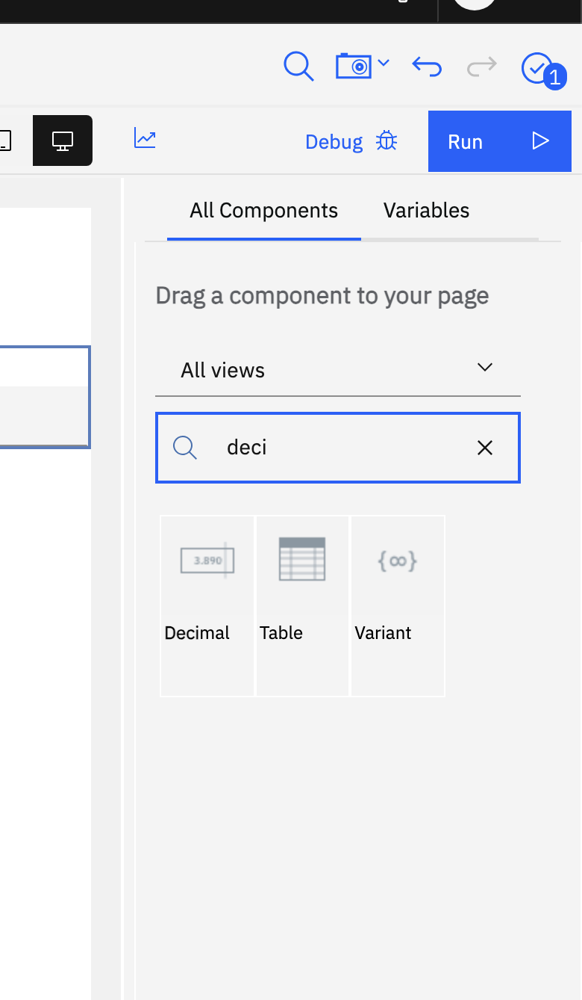

The screen should look like this:

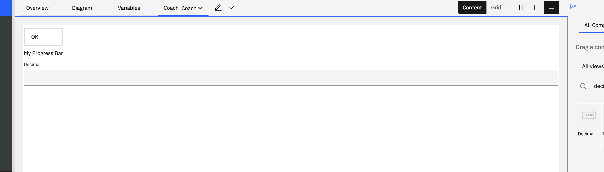

Click on Run:

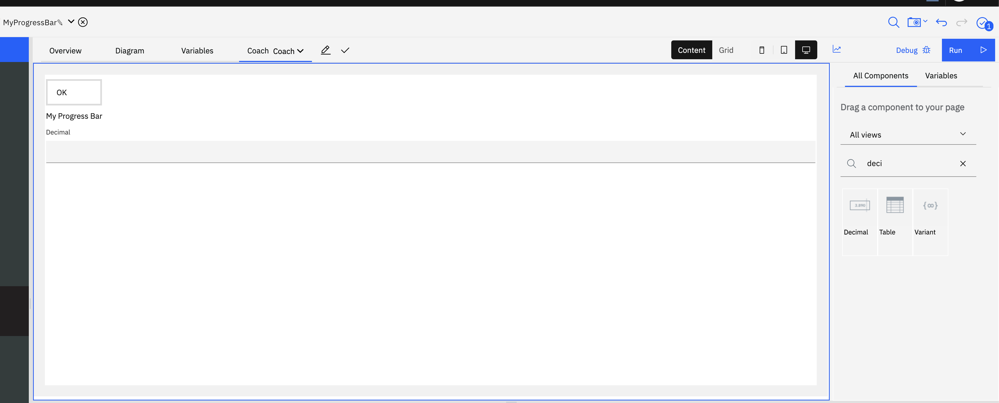

Update the decimal value to see the bar moving.

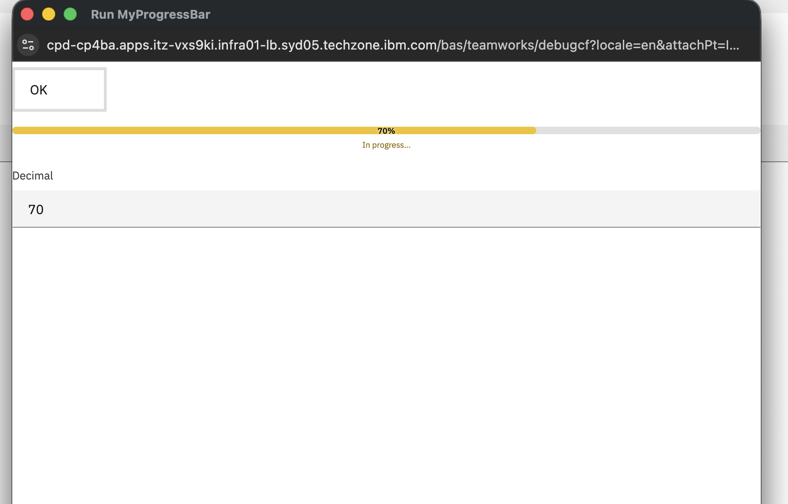


✅ **Checkpoint:** Your widget is working!

---

## Part 4: Understanding the Code (10 minutes)

### How It Works

### 💬 Prompt to Bob

```
Bob, please explain the widget structure for ProgressBar
```

**HTML Structure:**
**CSS Magic:**
**JavaScript Logic:**

### Key BAW Concepts

1. **Data Binding**: `this.getData()` retrieves the bound value from BAW
2. **Configuration Options**: `this.getOption('name')` gets the widget configuration
3. **Change Event**: Automatically fires when bound data updates
4. **ARIA Attributes**: `role="progressbar"` and `aria-*` attributes for accessibility


---

## Next Steps

### Enhance Your Widget

**Easy Customizations:**
- Change color thresholds (modify `getColorState` function)
- Adjust animation speed (change `transition` duration in CSS)
- Modify label text (set `labelText` option)
- Hide/show components (use `showLabel`, `showPercentage`, `showStatus` options)

**Advanced Features to Add:**
- Striped animation pattern for active progress
- Custom color schemes via options
- Milestone markers at specific percentages
- Multiple progress bars for comparison
- Vertical orientation option

### Explore More Widgets

Check out other widgets in the repository:
- **Breadcrumb/** - Navigation breadcrumbs with overflow handling
- **ProcessCircle/** - Circular progress indicator
- **Stepper/** - Multi-step process indicator
- **FileNetBrowser/** - File and folder browser

### Learn More

**Documentation:**
- [IBM BAW Documentation](https://www.ibm.com/docs/en/baw)
- [Carbon Design System](https://carbondesignsystem.com/)
- [Repository](https://github.com/MalekJabri/BOB-BAW-Widget)